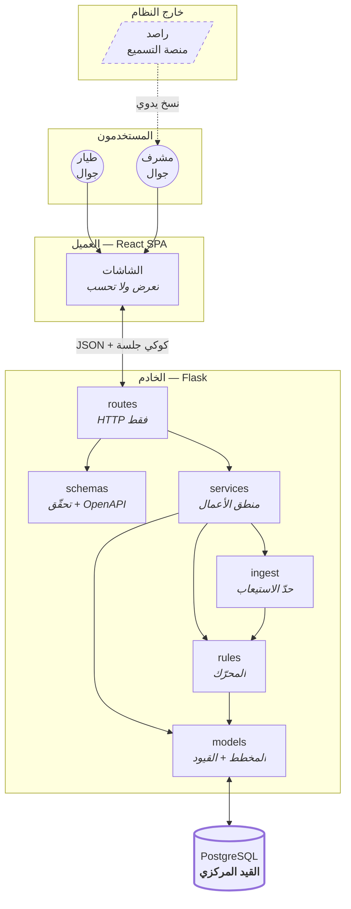

# المعمار (Stage 3)

> **يعتمد على:** `docs/product/SCOPE.md` مراجعة ٢.
> **القاعدة:** أبسط معمار يحقّق المتطلبات المعتمدة. كل تعقيد يحتاج دليلًا.

---

## ١. النظام في فقرة

**تطبيق ويب واحد من طبقتين:** واجهة React تعرض ولا تحسب، وخادم Flask يحسب كل شيء
ويحرس القواعد، وقاعدة PostgreSQL واحدة تحمل الحقيقة.

**لا خدمات، ولا قوائم انتظار، ولا ذاكرة وسيطة.** ٢٠٠ مستخدم يفتحون صفحات صغيرة
بضع مرات أسبوعيًّا — الحمل الذي يبرّر أيًّا من ذلك أبعد من هذا بمرتبتين. والتعقيد
الذي نضيفه اليوم يدفع ثمنه **صائنٌ واحد** كل يوم.

**راصد ليس نظامًا مربوطًا بنا.** هو مصدر بشري: المشرف ينسخ منه ويلصق عندنا. هذا
ليس عيبًا نتحمّله بل **حدٌّ نرسمه** — فلا اعتماد على نظام لا نملكه ولا يملك API.

---

## ٢. المخطّط



**الخطّ المتقطّع نحو راصد مقصود:** لا اتّصال آليًّا بيننا وبينه. الرابط إنسان.

---

## ٣. الوحدات

> لكل وحدة: **ما تملكه · ما لا تملكه · على من تعتمد · من يعتمد عليها.**
> عمود «ما لا تملكه» هو الأهمّ — هو ما يمنع تسرّب المسؤوليات.

### `routes/` — الحدّ الخارجي
| | |
|---|---|
| **تملك** | مسارات HTTP · رموز الحالة · قراءة الطلب وكتابة الردّ · تركيب الحرّاس |
| **لا تملك** | ❌ استعلامات قاعدة بيانات · ❌ منطق أعمال · ❌ حساب نقاط |
| **تعتمد على** | `schemas` · `services` · `security` |
| **يعتمد عليها** | لا أحد — **الطبقة الخارجية، ولا تُستورَد من الداخل أبدًا** |

**لماذا هذا القيد:** أوّل ما ينهار في مشاريع Flask هو أن يصير الـroute مكانًا
لكل شيء. القاعدة هنا واحدة وقابلة للفحص بالعين: **لا `select` ولا `db.session`
في ملفّ داخل `routes/`.**

### `schemas/` — التحقّق والعقد
| | |
|---|---|
| **تملك** | شكل الطلب والردّ · التحقّق من المدخلات · **توليد OpenAPI** |
| **لا تملك** | ❌ منطق أعمال · ❌ وصول للقاعدة |
| **تعتمد على** | لا شيء من مشروعنا |

Marshmallow عبر `flask-smorest`. **العقد يُولَّد من الكود لا يُكتب بجانبه** — فلا
يفترقان بعد شهر.

### `services/` — منطق الأعمال
| | |
|---|---|
| **تملك** | كل قرار عمل · المعاملات (transactions) · التنسيق بين الوحدات |
| **لا تملك** | ❌ HTTP · ❌ حساب الساعات (يفوّضه لـ`rules`) · ❌ فهم صيغ خارجية (يفوّضه لـ`ingest`) |
| **تعتمد على** | `models` · `rules` · `ingest` |
| **يعتمد عليها** | `routes` |

**ملفّ لكل مجال، لا ملفّ عملاق:** `auth` · `entry` · `reading` · `standings` ·
`readiness` · `fuel` · `rules_admin` · `paste` · `matching` · `reports`.

### `services/ledger.py` — **المالك الوحيد لسجلّ الأحداث**
| | |
|---|---|
| **تملك** | **كل إلحاق في `point_events`** · توليد `external_ref` · الحدث المعاكس |
| **لا تملك** | ❌ حساب الساعات (يفوّضه لـ`rules`) · ❌ فهم الصيغ (لـ`ingest`) · ❌ قرار *متى* يُلحق حدث (للخدمة صاحبة المجال) |
| **تعتمد على** | `models` |
| **يعتمد عليها** | `entry` · `reading` · `paste` · `fuel` · `questions` · `attendance` · `admin` |

```python
append(events: list[EventSpec]) -> list[PointEvent]
reverse(event_id, reason, actor_id) -> PointEvent
```

**المشكلة الحقيقية التي تحلّها** (شرط البوابة ٩ — مبرّر آنيّ لا متخيَّل):
**سبعة مسارات تكتب أحداثًا اليوم.** وكلٌّ منها يجب أن يحترم:
`external_ref` حتمي · القيد المركزي · حظر التعديل · التوقيت `occurred_at`.
**سبع نسخ من المسؤولية تعني أن السابعة ستنساها** — وهذا تعريف تداخل الملكية.

**وما ليست عليه:** ليست غلافًا على SQLAlchemy، ولا صنف CRUD عامًّا، ولا خدمة
إلهية. **دالّتان** بمسؤولية واحدة ضيّقة: *الإلحاق الصحيح*. أما *متى* يُلحق حدث
ولماذا، فتملكه الخدمة صاحبة المجال — `reading.py` تقرّر أن الاعتماد يستحقّ حدثًا،
و`ledger.py` تعرف كيف يُلحق حدثٌ صحيح.

**اختبار الحدّ:** إن احتاجت `ledger` يومًا أن تعرف ما «القراءة» أو ما «الوقود»،
فقد تجاوزت حدّها — والمنطق يعود إلى خدمة المجال.

### `ingest/` — حدّ الاستيعاب
| | |
|---|---|
| **تملك** | فهم الصيغ الغريبة وتحويلها إلى `Achievement` |
| **لا تملك** | ❌ **أي معرفة بالنقاط أو الرتب أو العملات** · ❌ كتابة في القاعدة |
| **تعتمد على** | `rules.engine.Achievement` (النوع فقط) |

**توقيع واحد:** `to_achievements(payload) -> list[Achievement]`.
**قيمته الحقيقية اليوم:** نحن **لا نعرف شكل تصدير راصد** (س-١). هذا الحدّ يجعل
جهلنا يكلّف **ملفًّا واحدًا** بدل أن ينتشر في الخدمات والمسارات والمخطط.

### `rules/` — المحرّك
| | |
|---|---|
| **تملك** | تحويل `Achievement` إلى ساعات · اختيار إصدار الأوزان الساري |
| **لا تملك** | ❌ الوقود (لترات يضيفها المشرف مباشرة) · ❌ الكتابة في `point_events` |
| **تعتمد على** | `models` |
| **يعتمد عليها** | `services` · `ingest` (النوع) |

**المكان الوحيد الذي تُحسب فيه الساعات في المشروع كلّه.**

### `models/` — المخطط والقيود
| | |
|---|---|
| **تملك** | الجداول · العلاقات · **القيود التي تحرس قواعد العمل** |
| **لا تملك** | ❌ منطق أعمال · ❌ استعلامات مركّبة · ❌ آثار جانبية |
| **تعتمد على** | `extensions` |

**النموذج ليس مكانًا للمنطق.** موديل فيه `def award_points()` يجعل حساب النقاط
يحدث في مكانين، ثم يفترقان.

### مصفوفة الملكية — لا مسؤولية بمالكين

| المسؤولية | المالك الوحيد | من **لا** يملكها رغم قربه |
|---|---|---|
| الإلحاق في `point_events` | **`services/ledger.py`** | `entry` · `reading` · `paste` · `fuel` · `questions` |
| حساب الساعات | `rules/engine.py` | `ledger` · `ingest` · أي خدمة |
| اختيار إصدار الأوزان | `rules/engine.py` | `services` |
| فهم الصيغ الخارجية | `ingest/*.py` | `services/paste.py` (تنسّق ولا تحلّل) |
| مطابقة الأسماء | `services/matching.py` | `ingest` |
| حساب «أرضي» | `services/readiness.py` | `standings` · `deck` — **تستدعيه ولا تعيد حسابه** |
| ترتيب الصدارة | `services/standings.py` | `deck` |
| التحقّق من المدخلات | `schemas/*.py` | `routes` · `services` |
| المصادقة والجلسات | `services/auth.py` + `security.py` | `routes` |
| فرض القيود الصلبة | **قاعدة البيانات** | كود التطبيق (يتحقّق **للرسالة** لا للضمانة) |

**قاعدة الفحص:** لكل صفّ **مالك واحد**، ولا مالك يظهر في عمودين كمسؤوليتين
منفصلتين. `rules/engine.py` يملك مسؤوليتين متلازمتين (الحساب واختيار الإصدار)
لأن **الثانية شرط الأولى** — فصلهما يخلق ملفًّا لا يُستدعى إلا من جاره.

---

## ٤. اتّجاه الاعتماديات

```
routes ──► schemas
   │
   └────► services ──┬──► ingest ──► rules ──► models ──► DB
                     │                 ▲         ▲
                     ├──► ledger ──────┼─────────┘
                     └─────────────────┘
```
`ledger` **داخل `services/`** — لا طبقة جديدة. يعتمد على `models` فقط، ولا
يستورد خدمة أخرى أبدًا (وإلا صارت دورة: `reading → ledger → reading`).

**قاعدة واحدة:** **الأسهم تتّجه إلى الداخل فقط.**

| ممنوع | لماذا |
|---|---|
| `models` يستورد `services` | يقلب الاتّجاه ويخلق دورة |
| `rules` يستورد `services` | يجعل المحرّك يعرف من يستدعيه — واختباره يصير مستحيلًا وحده |
| `ingest` يستورد `models` | يجعل الـadapter يكتب في القاعدة، ويسقط سببُ وجوده |
| `ledger` يستورد أي خدمة | دورة مباشرة — والخدمات هي مستدعوه |
| `routes` يستورد `models` مباشرةً | يفتح باب الاستعلام في الـroute |

**كيف يُفحص:** `grep -rn "from ..services" app/models app/rules` يجب أن يكون فارغًا.
فحصٌ يجريه إنسان في ثانية، لا أداة تحتاج إعدادًا.

---

## ٥. بنية المجلدات

```
asrab-v2/
├── AGENTS.md                  القواعد الدائمة
├── docs/                      المصدر الأول للحقيقة
│   ├── product/SCOPE.md
│   ├── design/{ARCHITECTURE,DATABASE,RULES,API,VISUAL}.md
│   └── decisions/ADR-*.md
│
├── api/
│   ├── app/
│   │   ├── __init__.py        create_app — التركيب فقط
│   │   ├── config.py          كل إعداد من متغيّر بيئة، بلا استثناء
│   │   ├── extensions.py      db · api — تُنشأ هنا وحدها لكسر الدورات
│   │   ├── security.py        @login_required · @admin_required
│   │   ├── models/            ملفّ لكل مجموعة جداول
│   │   ├── schemas/           ملفّ لكل مجال
│   │   ├── routes/            ملفّ لكل مجال ⚠️ لا تُسمَّ api/
│   │   ├── services/          ملفّ لكل مجال
│   │   ├── rules/engine.py    المحرّك
│   │   └── ingest/            base.py الواجهة · rasd.py · manual.py
│   ├── migrations/            Alembic — المصدر الوحيد للمخطط
│   ├── tests/
│   └── seed.py
│
├── scripts/
│   └── check-slice-gate.sh   بوابة تتبّع **للمستودع كلّه** (رُقّيت في و-١٣)
│
├── ui/                       ⭐ الواجهة المبنيّة — TypeScript
│   ├── public/fonts/         Almarai + IBM Plex Sans Arabic، مستضافة محليًّا
│   ├── scripts/              qa-core · visual-qa · AST · opaque-floor · contract · perf
│   └── src/
│       ├── styles/tokens.css **المكان الوحيد الذي يوجد فيه لون حرفيّ**
│       ├── nav/              History API — pushState/popstate، بلا موجّه مسارات
│       ├── api/              client · brand (Decimal) · format · types/ · endpoints/
│       ├── state/            AppState (هوية فقط) · useAsync
│       ├── ui/               بدائيات بصرية — بدائية لكل ملفّ
│       ├── motion/           GSAP + **كل الحساب الهندسيّ**
│       └── screens/          pilot/ · admin/ — تعرض ولا تحسب
│
└── web/                      🔒 **مرجع لا أساس** — البناء الأول (JSX)، مجمَّد
```

> **`web/` مرجعٌ لا يُعدَّل ولا يُحذف** — نفس معاملة `/home/mohammed/projects/asrab`
> المنصوص عليها في `AGENTS.md`. بواباتُه تبقى تعمل شبكةَ انحدارٍ تثبت أن البناء
> الجديد لم يكسر المرجع، **وأمر التشغيل الحيّ يشير إلى `ui/`** بعد التحويل.

### لماذا يوجد كل مجلد

| المجلد | لماذا | ما لا ينتمي إليه |
|---|---|---|
| `extensions.py` | `db` و`api` تُنشأ **مرة واحدة** فيُكسر الاستيراد الدائري | أي منطق |
| `migrations/` | **المخطط يُولَد من الهجرات وحدها**، لا من `create_all` — وإلا اختلفت التطوير عن الإنتاج بصمت | — |
| `scripts/` (الجذر) | بوابة التتبّع تخصّ المستودع كلّه لا الواجهة — وبقاؤها داخل مجلّد متروك يجعل نسختها الوحيدة رهينة مجلّد ميت | أي شيء خاصّ بواجهة بعينها |
| `ui/src/ui/` | بدائيات بصرية قابلة لإعادة الاستعمال | ❌ استدعاء API · ❌ منطق أعمال |
| `ui/src/motion/` | **كل الحساب الهندسيّ** (قوس · زاوية · إحداثيات) — هندسةٌ لا قاعدة عمل، ولذلك هو خارج نطاق فحص AST **بقصد موثَّق** | ❌ قرار مجال · ❌ عتبة · ❌ وزن |
| `ui/src/api/` | **نقطة الاتّصال الوحيدة** — فتغيير المصادقة يمسّ ملفًّا واحدًا. و`brand.ts` يمنع خلط العشريّ النصّيّ بالرقم | منطق عرض |
| `ui/src/screens/` | شاشة لكل مسار، **تعرض ولا تحسب** (`AGENTS.md` ٥) | ❌ مقارنة · ❌ عملية حسابية · ❌ رقم مجال |
| `seed.py` | `TRUNCATE ... RESTART IDENTITY` فتصير المعرّفات حتمية والاختبارات مستقرّة | بيانات إنتاج |

> ⚠️ **`routes/` لا تُسمَّى `api/`** — تطمس كائن `Api` القادم من `extensions`.
> خطأ وقع فعلًا في البناء الأول.

**قاعدة الحجم:** ملفّ يتجاوز **~١٥٠ سطرًا يُراجَع**. ليس حدًّا مقدَّسًا، بل إشارة
إلى أن الملفّ غالبًا يفعل شيئين.

---

## ٦. معالجة الأخطاء

| النوع | الرمز | للمستخدم | في السجلّ |
|---|--:|---|---|
| تحقّق من المدخلات | 422 | **يسمّي الحقل والحلّ** | لا شيء |
| بيانات متضاربة (لصق مكرّر · إجابة مكرّرة) | 409 | يشرح التضارب وما يفعله | معلومة |
| غير مصادَق | 401 | «انتهت جلستك، ادخل مجدّدًا» | معلومة |
| مصادَق وغير مخوَّل | 403 | رسالة عامّة — **لا تكشف وجود المورد** | تحذير + منسوب |
| غير موجود | 404 | رسالة عامّة | لا شيء |
| قفل محاولات | 429 | يذكر **متى** يُفتح القفل | تحذير |
| فشل داخلي | 500 | **رسالة عامّة بلا تفاصيل** | خطأ كامل + أثر |

**ثلاث قواعد لا تُخالَف:**
1. **لا خطأ يُبتلَع صامتًا.** `except: pass` ممنوع.
2. **لا تفصيل داخلي يصل للمستخدم.** لا `traceback` ولا رسالة SQL.
3. **رسالة الخطأ تسمّي المشكلة والحلّ.** «حدث خطأ ما» ليست رسالة خطأ.

**وما لا نبنيه:** لا هرم استثناءات · لا رموز أخطاء مرقّمة · لا معالج مركزي معقّد.
سبعة صفوف لا تحتاج إطارًا.

---

## ٧. الأمان

### ٧.١ المصادقة

| الطبقة | القرار | لماذا |
|---|---|---|
| كلمة السرّ | PIN أربعة أرقام مهشَّر **argon2id** | ١٠٬٠٠٠ احتمال — الهشّ يُكسر في ثوانٍ بلا تهشير قويّ |
| الجلسة | توكن ٣٢ بايت عشوائي، **مخزَّن مهشَّرًا SHA-256** | ٢٥٦ بت لا تُخمَّن، وargon2 على كل طلب كلفة بلا مقابل |
| النقل | كوكي `HttpOnly` · `SameSite=Lax` · `Secure` **من متغيّر بيئة** | المتصفّح يرفض الكوكي الآمن على http، فتثبيته يكسر أحد الطرفين |
| الإبطال | **جلسات في القاعدة لا JWT** | طالب ضاع جواله يجب أن يُخرَج **الآن** لا بعد ٩٠ يومًا (ADR-003) |
| التعداد | **رسالة واحدة** لرقم غير موجود ورمز خاطئ | التفريق يحوّل شاشة الدخول إلى أداة تعداد للطلاب |
| الأسرار | **كلها من البيئة** — لا سرّ في الكود ولا في git | — |
| **الرمز عند الإنشاء** 🆕 | يولّده الخادم بـ`secrets` ويُعاد **مرّةً واحدة**، ولا يُخزَّن نصًّا ولا يظهر في قراءةٍ ولا في سطر تدقيق | مشرفٌ يملأ مئتَي رمز بيده يكتب `1234` للجميع؛ و`random` يُستنتَج من مخرجاته |
| **التعطيل** 🆕 | علمٌ يمنع الدخول **ويُبطل الجلسات القائمة** | علمٌ يترك كوكيًّا حيًّا عمرُه تسعون يومًا ليس تعطيلًا |
| **آخر مشرف** 🆕 | لا يُنزَّل ولا يُعطَّل | التأسيس على قاعدةٍ فارغة وحدها، فالتعافي من القفل يحتاج SQL يدويًّا على الخادم |

### ٧.١ب تصليب الحدّ (و-٢١)

| الطبقة | القرار | لماذا |
|---|---|---|
| سقف جسم الطلب | ٢ MiB، وتجاوزه `413` بشكل `{"message"}` | غيابُه أرخص هجوم على المنصّة: استنزاف ذاكرة بطلبٍ واحد بلا حساب. و٤١٣ الافتراضيّ صفحةُ HTML تكسر العقد على أكبر مسارٍ يرفع ملفًّا |
| ترويسات الأمان | CSP بـ`script-src 'self'` بلا استثناء · `nosniff` · `X-Frame-Options: DENY` · `Referrer-Policy` · `Permissions-Policy` — على **كل** ردّ شاملًا الخطأ | ردُّ الخطأ أوّل ما يصل متصفّحًا مخترقًا، فترويسةٌ على الناجح وحده تُغطّي الأسهل وتترك الأصعب. والسياسة صارمةٌ لأنها تستطيع: الواجهة المبنيّة بلا موردٍ خارجيّ واحد |
| HSTS | سنةٌ + النطاقات الفرعية — **خلف HTTPS وحده** | إرسالها محليًّا يقفل `localhost` على https **سنةً** في متصفّح المطوّر، فيتبعه العطل إلى كل مشروع على نفس المنفذ |
| حدود المعدّل | الدخول ٥/١٥د · القراءات ٢٠/يوم. **والملاحظات بلا حدّ بقرارٍ معلَن** | حدُّ الملاحظات لكل طالب يستلزم عدّادًا منسوبًا بزمن، وهو يُعيد الارتباطَ الذي بُني `notes` لمنعه (`NFR-04`). التفصيل في `API.md §١` |

### ٧.٢ CSRF — نتيجة مباشرة للمصادقة بالكوكي

**المشكلة:** الكوكي يُرسَل تلقائيًّا مع كل طلب إلى نطاقنا، **بما فيه طلب أرسله
موقع آخر**. صفحة خبيثة تستطيع أن تجعل متصفّح الطالب يُرسل
`POST /api/admin/events/{id}/reverse` وهو لا يدري.

**الدفاع طبقتان مستقلّتان:**

| الطبقة | ماذا تفعل | ما لا تكفيه وحدها |
|---|---|---|
| `SameSite=Lax` | المتصفّح **لا يرسل الكوكي** مع طلب مغيِّر للحالة من موقع آخر | متصفّح قديم لا يدعمها ⇒ لا حماية |
| **فحص `Origin`** على كل طلب غير `GET`/`HEAD` | يرفض بـ`403` إن لم يطابق النطاق المسموح | لا يعمل إن حُذفت الترويسة — ولذلك **غياب `Origin` على طلب مغيِّر يُرفض** |

**ولا توكنات CSRF.** الكوكي `HttpOnly` — أي أن JS لا يقرؤه أصلًا، فنمط
double-submit لا ينطبق. وتوكن في القالب يعني حالة خادمية إضافية لكل نموذج،
وكلفة صيانة دائمة، لحماية **تغطّيها الطبقتان أعلاه**. (ADR-006)

**التنفيذ:** `before_request` واحد في `app/__init__.py`. الأصول المسموحة من
متغيّر بيئة — لأن `localhost:5173` في التطوير ونطاق الإنتاج مختلفان.

### ٧.٣ التخويل — مشرفون على مستوى الجمعية

> **القرار المعتمد:** `role='admin'` صلاحية **على مستوى المنظمة كلّها**.

| البند | القاعدة |
|---|---|
| الحارس | `@admin_required` يفحص `role='admin'` في **العضوية السارية** (`left_at IS NULL`) |
| النطاق | كل استعلام إداري يُقيَّد بـ**`org_id` وحده** |
| `team_id` للمشرف | **مرشّح افتراضي في الواجهة — وليس حاجزًا أمنيًّا** |
| الحارس على المسار | `@admin_required` **على تعريف المسار** لا داخل الجسم — نسيانه في الجسم لا يُرى في المراجعة |

> ⚠️ **نصّ ملزم:** لا يجوز لأي كود لاحق أن يفترض أن `memberships.team_id` يحدّ ما
> يراه المشرف. مشرف واحد يستطيع رؤية كل طلاب الجمعية وتعديل بياناتهم.
>
> **لماذا هذا هو الصحيح هنا:** اللصق من راصد يأتي **لكل الطلاب دفعة واحدة**، لا
> سربًا سربًا. وحدٌّ على مستوى السرب كان سيمنع أهمّ عملية في المنتج.
>
> **وثمنه مدفوع بـFR-084:** الحماية **كشف الاستعمال** (سجلّ تدقيق مرئي لكل
> المشرفين) لا **منع الصلاحية**. وهذا امتداد متّسق لما قرّرناه في `SCOPE.md` §٣.٣.

### ٧.٤ تحديد المعدّل

| المسار | الحدّ | لماذا هذا تحديدًا |
|---|---|---|
| `POST /auth/login` | ٥ محاولات / ١٥ دقيقة لكل `student_no` | ١٠٬٠٠٠ احتمال تُكسر آليًّا بلا حدّ |
| `POST /notes` | ١٠ / ساعة لكل جلسة | **مجهول المصدر بنية الجدول** ⇒ لا سبيل لتنظيف إغراق بعد وقوعه |
| `POST /me/readings` | ٢٠ / يوم لكل مستخدم | يمنع إغراق طابور المشرف — وهو ما يقتل NFR-02 |

**العدّ في القاعدة** (`login_attempts` وجدول عدّ خفيف)، **لا في الذاكرة**: الذاكرة
تضيع مع كل إعادة تشغيل، وتكذب مع أكثر من عامل (worker).

**وما لا نبنيه:** لا حدّ عامّ على كل المسارات. `GET` عندنا رخيص، والحدّ الشامل
يعاقب الاستعمال الطبيعي ويخفي الإساءة الحقيقية في الضجيج.

> ### ⏸️ مؤجَّل — حدّا `/notes` و`/me/readings`
>
> **المنفَّذ اليوم: قفل الدخول وحده** (`login_attempts`). وحدّا `/notes`
> (١٠/ساعة) و`/me/readings` (٢٠/يوم) **موثَّقان وغير منفَّذين**.
>
> **قرار مؤرَّخ (و-٤): يُؤجَّلان، ولا تُبنى بنية تحديد معدّل عامّة الآن.**
>
> | لماذا | |
> |---|---|
> | حالة الإساءة الأولى مغطّاة | `UNIQUE (user_id, read_on, book_title)` يمنع التكرار الأشيع — الإرسال المزدوج بنقرتين |
> | البنية العامّة كلفة لا تخدم الهدف | «أقصر طريق إلى حلقة عمل حقيقية» لا يمرّ بها |
> | الضرر محدود ومكشوف | كل طلب منسوب لطالب معروف في جمعية يعرف أعضاؤها بعضهم، والمشرف يرى الطابور — **كشف الاستعمال لا منع الصلاحية**، كما في `SCOPE.md` §٣.٣ |
>
> **وهذا تأجيل لا سهو.** يُبنى حين يظهر إغراق حقيقي، أو مع `/notes` في و-٩ —
> **أيّهما أسبق**. والملاحظات أخطر: مجهولة بنية الجدول، فلا سبيل لتنظيف إغراقها
> بعد وقوعه، بخلاف القراءات التي يرفضها المشرف بسبب.

### ٧.٥ إعادة تعيين PIN

**لا استعادة ذاتية** — لا بريد ولا رسائل نصّية لقاصرين، ولا سؤال سرّي يُخمَّن.

| الخطوة | القاعدة |
|---|---|
| من | أي مشرف (§٧.٣) |
| كيف | يولّد النظام PIN جديدًا ويعرضه **مرّة واحدة** — لا يُخزَّن نصًّا صريحًا أبدًا |
| الجلسات | **تُبطَل كلها فورًا** — إعادة التعيين سببها غالبًا فقدان الجهاز، وترك جلساته حيّة يُبطل الغرض |
| التدقيق | يُسجَّل في `audit_log` منسوبًا — **بلا قيمة الـPIN** |

### ٧.٦ ما لا يُبنى عمدًا
لا أدوار دقيقة · لا OAuth · لا 2FA · لا تشفير على مستوى الحقل · لا سياسة
كلمات سرّ معقّدة (PIN بحكم التعريف بسيط، والحماية في الحدّ والتهشير).

**أمان بحجم الخطر، لا مسرح أمني.**

---

## ٨. التشغيل

| | القرار |
|---|---|
| السجلّات | نصّية إلى `stdout` — تلتقطها أي منصّة استضافة |
| الصحّة | `GET /health` يفحص **اتّصال القاعدة فعلًا** لا يردّ `200` أعمى |
| القياس | زمن الاستجابة في السجلّ · **لا Prometheus ولا لوحات** |
| النشر | `Dockerfile` واحد · كل إعداد من البيئة · الوجهة مؤجَّلة (ف-٥) |
| الهجرات | Alembic يدويًّا قبل التشغيل — **لا هجرة تلقائية عند الإقلاع** |
| **التأسيس** 🆕 | `flask bootstrap-org` — **المدخل الوحيد** لجمعيةٍ وأوّل مشرف، على قاعدةٍ فارغة وحدها ويرفض الثانية. أمرُ طرفية لا مسارٌ عامّ: مسارٌ يُنشئ جمعيةً ومشرفًا هو بابٌ لمن يسبق صاحبَ الخادم إليه، والطرفيةُ داخل الحاوية صلاحيتُها صلاحيةُ الخادم أصلًا — فلا سطح هجوم جديد |
| **حرسُ الإقلاع** 🆕 | يرفض التشغيل خلف HTTPS بمفتاحٍ تطويريّ أو `CORS` فارغة أو وثائق API مكشوفة. نفس مبدأ حرس `seed.py`: **الفشل الصاخب أرحم من الصامت**، ويُرى في سجلّ النشر لا بعد أسبوعٍ من استعمالٍ غير آمن |
| النسخ | `deploy/backup.sh` — نسخةٌ يوميّة تُبقي أربعة عشر يومًا، **وترفض نسخةً فارغة**: `pg_dump` الفاشل عبر أنبوبٍ يُنتج ملفًّا صالح الشكل خاوي المحتوى، فتُكتشَف الكارثة يوم الاستعادة لا يوم النسخ. ونقلُها خارج الخادم بيد صاحبه |
| **السقالة** 🆕 | `services/provision.py` مالكٌ واحد لرتب الجمعية وأوزانها وافتراضات راصد — **تشاركه البذرةُ والإنتاج**. سقالتان منفصلتان تفترقان بأوّل صفٍّ يُضاف لإحداهما، فيُختبَر المشروع على أوزانٍ ليست التي تُنشَر |

---

## ٩. ما لا يُبنى عمدًا

| المستبعَد | لماذا رُفض |
|---|---|
| Repository فوق SQLAlchemy | SQLAlchemy **هو** طبقة الوصول. غلافها يجعل تتبّع استعلام يمرّ بأربعة ملفّات |
| صنف CRUD عامّ | كل مورد عندنا له قاعدة عمل مختلفة — العموم يخفيها ولا يوحّدها |
| حاقن اعتماديات | Flask يوفّر ما يكفي. الحاقن يحلّ مشكلة لا نملكها |
| طبقة DTO ثالثة | `schemas` كافية. الثالثة تعني ترجمة الحقل ثلاث مرات |
| Redis / قوائم انتظار | لا عملية تتجاوز ثانية. الطابور يحلّ بطئًا غير موجود |
| GraphQL | ثمانية عملاء معروفون. مرونة الاستعلام هنا تكلفة بلا مشتري |
| microservices | صائن واحد وقاعدة واحدة |
| SSR / Next.js | التطبيق خلف تسجيل دخول — **لا SEO ولا زائر مجهول** |

**القاعدة:** **طبقة تُضاف حين يوجعنا غيابها، لا احتياطًا.**

---

## ١٠. بوابات Stage 4 الصارمة

> **الدرجات لا تُصدر حكمًا.** بوابة واحدة ساقطة ⇒ **NOT READY**، مهما كان المتوسّط.
> كل بوابة أدناه شُغّلت **فعليًّا** بأمر قابل للتكرار، لا من الذاكرة.

| # | البوابة | الحكم | الدليل |
|---|---|:--:|---|
| ١ | مسار تنفيذ لكل متطلَّب | ✅ | `TRACEABILITY.md` — ٤١ صفًّا · `comm` فارغ في الاتّجاهين |
| ٢ | endpoint له متطلَّب أو غرض بنيوي | ✅ | `API.md` §٢ — `/health` و`/openapi.json` موثَّقان كبنيويّين |
| ٣ | جدول له غرض موثَّق | ✅ | `DATABASE.md` §٣ — **٢٤/٢٤** · `comm` فارغ |
| ٤ | فهرس/قيد له مسار | ✅ | §٤.١ ٨ فهارس · §٤.٢ ٨ قيود · **٨ `UNIQUE` في المخطط = ٨ موثَّقة** |
| ٥ | ثابت له موضع فرض | ✅ | §٤.٣ — **١٥ ثابتًا**، صفر بلا موضع |
| ٦ | لا تداخل ملكية | ✅ | §٣ مصفوفة الملكية — `ledger` مالك وحيد للسجلّ |
| ٧ | لا اعتماد دائري | ✅ | §٤ — ٥ ممنوعات · `grep` قابل للتنفيذ |
| ٨ | اتّجاه الاعتماديات صريح | ✅ | §٤ — «الأسهم تتّجه إلى الداخل فقط» |
| ٩ | تجريد بمبرّر آنيّ | ✅ | `RuleSet` (٣٦←٣ استعلامات) · `ledger` (٧ مستدعين) · `Adapter` (عزل س-١) |
| ١٠ | الأسئلة المفتوحة معزولة | ✅ | ADR-005 — س-١ تكلّف **صفًّا + ملفًّا**، بلا تصميم تخميني |
| ١١ | لا قرار أمني معلَّق | ✅ | §٧ — CSRF · `Origin` · حدود المعدّل · التخويل · إعادة تعيين PIN · ADR-006 |
| ١٢ | الشريحة الأولى معرَّفة | ✅ | `docs/plans/SLICE-01.md` |
| ١٣ | عناصرها الثمانية | ✅ | ٨ أقسام مرقّمة · **١٢ معيار قبول ملحوظًا** |

**١٣/١٣.**

### أوامر الفحص

```bash
# ١ — تتبّع بلا يتيم
comm -3 <(grep -o 'FR-[0-9]\{3\}' docs/product/SCOPE.md | sort -u) \
        <(grep -o 'FR-[0-9]\{3\}' docs/design/TRACEABILITY.md | sort -u)

# ٣ — كل جدول له غرض
comm -23 <(grep -oE '^[a-z_]+\(' docs/design/DATABASE.md | tr -d '(' | sort -u) \
         <(sed -n '/^## ٣. الجداول — الغرض/,/^## ٣.١/p' docs/design/DATABASE.md \
           | grep -oE '^\| `[a-z_]+`' | tr -d '|` ' | sort -u)

# ٤ — قيود المخطط = القيود الموثَّقة
grep -cE '^ *UNIQUE ' docs/design/DATABASE.md      # ٨
sed -n '/^### ٤.٢/,/^\*\*٨ فهارس/p' docs/design/DATABASE.md | grep -c '^| `'   # ٨

# ٥ — ثابت بلا موضع فرض
grep -E '^\| ث-' docs/design/DATABASE.md | awk -F'|' '{gsub(/ /,"",$4); if($4=="") print}'

# ١٣ — العناصر الثمانية
grep -cE '^## [٠-٩]' docs/plans/SLICE-01.md       # ٨
```

**الثلاثة الأولى: مخرَجٌ فارغ = نجاح.**

### ما كشفته البوابات فعلًا

| # | الخطأ | لماذا لم يُكتشف بالدرجات |
|---|---|---|
| ١ | `point_events` بـ**٧ كتّاب بلا مالك** | الدرجة تسأل «هل المعمار واضح؟» لا «هل لكل مسؤولية مالك واحد؟» |
| ٢ | **ث-٢ قاعدة نصّية بلا فرض** — نقضٌ حرفيّ لـADR-002 | كتبتُ المبدأ وطبّقتُه على العملات ونسيتُه على السجلّ نفسه |
| ٣ | **CSRF غير مذكور** ومصادقتنا بالكوكي | ADR-003 اختار الكوكي ولم يذكر ما يترتّب عليه |
| ٤ | **١٨ جدولًا بلا غرض**، وادّعاء «١٩ لكلٍّ لماذا يوجد» **غير صحيح** | ادّعاء في جدول الفحص نفسه، بلا أمر يفحصه |
| ٥ | `teams(org_id, code)` **موثَّق وغائب عن المخطط** | ظهر عند مطابقة العدّ: ٨ موثَّقة مقابل ٦ معلَنة |
| ٦ | **FR-022 يناقض قرار التخويل** («طابور سربه») | نصّ قديم نجا من تصحيح ARCHITECTURE و API |

### المخاطر الباقية
| # | الخطر | التخفيف |
|---|---|---|
| خ-٢ | شكل تصدير راصد مجهول | معزول في `ingest/rasd.py` + صفّ أوزان (ADR-005) |
| خ-٥ | المعايرة مؤلَّفة | `raw_rows` + `/admin/recalc` ⇒ إعادة حساب كاملة |
| خ-١ | توقّف المشرف عن الإدخال | NFR-02 مقياس مُلزِم · اللصق بدل الإدخال |

### القرار
> # ✅ READY FOR STAGE 4
> **١٣/١٣ بوابة صارمة ناجحة**، كلٌّ بدليل وأمر فحص قابل للتكرار.
> **البدء بـ[`SLICE-01.md`](../plans/SLICE-01.md) — أصغر شريحة رأسية ذات معنى.**
