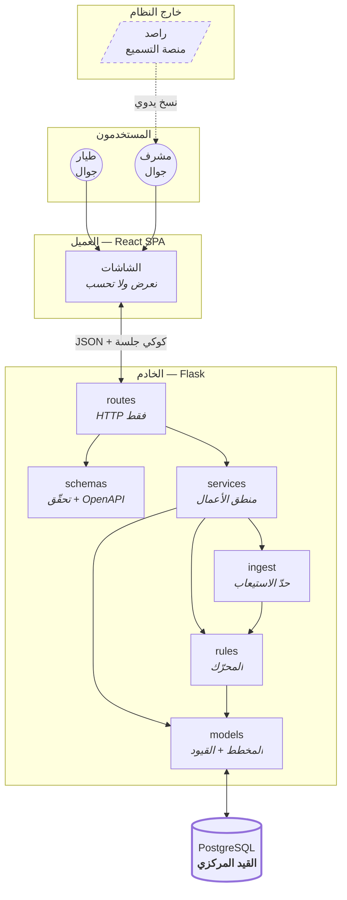

# المعمار (Stage 3)

> **يعتمد على:** `docs/product/SCOPE.md` مراجعة ٢.
> **القاعدة:** أبسط معمار يحقّق المتطلبات المعتمدة. كل تعقيد يحتاج دليلًا.

---

## ١. النظام في فقرة

**تطبيق ويب واحد من طبقتين:** واجهة React تعرض ولا تحسب، وخادم Flask يحسب كل شيء
ويحرس القواعد، وقاعدة PostgreSQL واحدة تحمل الحقيقة.

**لا خدمات، ولا قوائم انتظار، ولا ذاكرة وسيطة.** ٢٠٠ مستخدم يفتحون صفحات صغيرة
بضع مرات أسبوعيًّا — الحمل الذي يبرّر أيًّا من ذلك أبعد من هذا بمرتبتين. والتعقيد
الذي نضيفه اليوم يدفع ثمنه **صائنٌ واحد** كل يوم.

**راصد ليس نظامًا مربوطًا بنا.** هو مصدر بشري: المشرف ينسخ منه ويلصق عندنا. هذا
ليس عيبًا نتحمّله بل **حدٌّ نرسمه** — فلا اعتماد على نظام لا نملكه ولا يملك API.

---

## ٢. المخطّط



**الخطّ المتقطّع نحو راصد مقصود:** لا اتّصال آليًّا بيننا وبينه. الرابط إنسان.

---

## ٣. الوحدات

> لكل وحدة: **ما تملكه · ما لا تملكه · على من تعتمد · من يعتمد عليها.**
> عمود «ما لا تملكه» هو الأهمّ — هو ما يمنع تسرّب المسؤوليات.

### `routes/` — الحدّ الخارجي
| | |
|---|---|
| **تملك** | مسارات HTTP · رموز الحالة · قراءة الطلب وكتابة الردّ · تركيب الحرّاس |
| **لا تملك** | ❌ استعلامات قاعدة بيانات · ❌ منطق أعمال · ❌ حساب نقاط |
| **تعتمد على** | `schemas` · `services` · `security` |
| **يعتمد عليها** | لا أحد — **الطبقة الخارجية، ولا تُستورَد من الداخل أبدًا** |

**لماذا هذا القيد:** أوّل ما ينهار في مشاريع Flask هو أن يصير الـroute مكانًا
لكل شيء. القاعدة هنا واحدة وقابلة للفحص بالعين: **لا `select` ولا `db.session`
في ملفّ داخل `routes/`.**

### `schemas/` — التحقّق والعقد
| | |
|---|---|
| **تملك** | شكل الطلب والردّ · التحقّق من المدخلات · **توليد OpenAPI** |
| **لا تملك** | ❌ منطق أعمال · ❌ وصول للقاعدة |
| **تعتمد على** | لا شيء من مشروعنا |

Marshmallow عبر `flask-smorest`. **العقد يُولَّد من الكود لا يُكتب بجانبه** — فلا
يفترقان بعد شهر.

### `services/` — منطق الأعمال
| | |
|---|---|
| **تملك** | كل قرار عمل · المعاملات (transactions) · التنسيق بين الوحدات |
| **لا تملك** | ❌ HTTP · ❌ حساب الساعات (يفوّضه لـ`rules`) · ❌ فهم صيغ خارجية (يفوّضه لـ`ingest`) |
| **تعتمد على** | `models` · `rules` · `ingest` |
| **يعتمد عليها** | `routes` |

**ملفّ لكل مجال، لا ملفّ عملاق:** `auth` · `entry` · `reading` · `standings` ·
`readiness` · `fuel` · `rules_admin` · `paste` · `matching` · `reports`.

### `ingest/` — حدّ الاستيعاب
| | |
|---|---|
| **تملك** | فهم الصيغ الغريبة وتحويلها إلى `Achievement` |
| **لا تملك** | ❌ **أي معرفة بالنقاط أو الرتب أو العملات** · ❌ كتابة في القاعدة |
| **تعتمد على** | `rules.engine.Achievement` (النوع فقط) |

**توقيع واحد:** `to_achievements(payload) -> list[Achievement]`.
**قيمته الحقيقية اليوم:** نحن **لا نعرف شكل تصدير راصد** (س-١). هذا الحدّ يجعل
جهلنا يكلّف **ملفًّا واحدًا** بدل أن ينتشر في الخدمات والمسارات والمخطط.

### `rules/` — المحرّك
| | |
|---|---|
| **تملك** | تحويل `Achievement` إلى ساعات · اختيار إصدار الأوزان الساري |
| **لا تملك** | ❌ الوقود (لترات يضيفها المشرف مباشرة) · ❌ الكتابة في `point_events` |
| **تعتمد على** | `models` |
| **يعتمد عليها** | `services` · `ingest` (النوع) |

**المكان الوحيد الذي تُحسب فيه الساعات في المشروع كلّه.**

### `models/` — المخطط والقيود
| | |
|---|---|
| **تملك** | الجداول · العلاقات · **القيود التي تحرس قواعد العمل** |
| **لا تملك** | ❌ منطق أعمال · ❌ استعلامات مركّبة · ❌ آثار جانبية |
| **تعتمد على** | `extensions` |

**النموذج ليس مكانًا للمنطق.** موديل فيه `def award_points()` يجعل حساب النقاط
يحدث في مكانين، ثم يفترقان.

---

## ٤. اتّجاه الاعتماديات

```
routes ──► schemas
   │
   └────► services ──► ingest ──┐
             │                  ├──► rules ──► models ──► DB
             └──────────────────┘
```

**قاعدة واحدة:** **الأسهم تتّجه إلى الداخل فقط.**

| ممنوع | لماذا |
|---|---|
| `models` يستورد `services` | يقلب الاتّجاه ويخلق دورة |
| `rules` يستورد `services` | يجعل المحرّك يعرف من يستدعيه — واختباره يصير مستحيلًا وحده |
| `ingest` يستورد `models` | يجعل الـadapter يكتب في القاعدة، ويسقط سببُ وجوده |
| `routes` يستورد `models` مباشرةً | يفتح باب الاستعلام في الـroute |

**كيف يُفحص:** `grep -rn "from ..services" app/models app/rules` يجب أن يكون فارغًا.
فحصٌ يجريه إنسان في ثانية، لا أداة تحتاج إعدادًا.

---

## ٥. بنية المجلدات

```
asrab-v2/
├── AGENTS.md                  القواعد الدائمة
├── docs/                      المصدر الأول للحقيقة
│   ├── product/SCOPE.md
│   ├── design/{ARCHITECTURE,DATABASE,RULES,API,VISUAL}.md
│   └── decisions/ADR-*.md
│
├── api/
│   ├── app/
│   │   ├── __init__.py        create_app — التركيب فقط
│   │   ├── config.py          كل إعداد من متغيّر بيئة، بلا استثناء
│   │   ├── extensions.py      db · api — تُنشأ هنا وحدها لكسر الدورات
│   │   ├── security.py        @login_required · @admin_required
│   │   ├── models/            ملفّ لكل مجموعة جداول
│   │   ├── schemas/           ملفّ لكل مجال
│   │   ├── routes/            ملفّ لكل مجال ⚠️ لا تُسمَّ api/
│   │   ├── services/          ملفّ لكل مجال
│   │   ├── rules/engine.py    المحرّك
│   │   └── ingest/            base.py الواجهة · rasd.py · manual.py
│   ├── migrations/            Alembic — المصدر الوحيد للمخطط
│   ├── tests/
│   └── seed.py
│
└── web/
    ├── public/fonts/          مستضافة محليًّا
    └── src/
        ├── styles.css         عالم «المدرّج والشارة»
        ├── components/        عناصر بصرية بلا منطق أعمال
        ├── pages/             شاشة لكل مسار
        ├── admin/             شاشات المشرف
        ├── lib/api.js         نقطة الاتّصال الوحيدة بالخادم
        └── state/
```

### لماذا يوجد كل مجلد

| المجلد | لماذا | ما لا ينتمي إليه |
|---|---|---|
| `extensions.py` | `db` و`api` تُنشأ **مرة واحدة** فيُكسر الاستيراد الدائري | أي منطق |
| `migrations/` | **المخطط يُولَد من الهجرات وحدها**، لا من `create_all` — وإلا اختلفت التطوير عن الإنتاج بصمت | — |
| `components/` | عناصر بصرية قابلة لإعادة الاستعمال | ❌ استدعاء API · ❌ منطق أعمال |
| `lib/api.js` | **نقطة الاتّصال الوحيدة** — فتغيير المصادقة يمسّ ملفًّا واحدًا | منطق عرض |
| `seed.py` | `TRUNCATE ... RESTART IDENTITY` فتصير المعرّفات حتمية والاختبارات مستقرّة | بيانات إنتاج |

> ⚠️ **`routes/` لا تُسمَّى `api/`** — تطمس كائن `Api` القادم من `extensions`.
> خطأ وقع فعلًا في البناء الأول.

**قاعدة الحجم:** ملفّ يتجاوز **~١٥٠ سطرًا يُراجَع**. ليس حدًّا مقدَّسًا، بل إشارة
إلى أن الملفّ غالبًا يفعل شيئين.

---

## ٦. معالجة الأخطاء

| النوع | الرمز | للمستخدم | في السجلّ |
|---|--:|---|---|
| تحقّق من المدخلات | 422 | **يسمّي الحقل والحلّ** | لا شيء |
| بيانات متضاربة (لصق مكرّر · إجابة مكرّرة) | 409 | يشرح التضارب وما يفعله | معلومة |
| غير مصادَق | 401 | «انتهت جلستك، ادخل مجدّدًا» | معلومة |
| مصادَق وغير مخوَّل | 403 | رسالة عامّة — **لا تكشف وجود المورد** | تحذير + منسوب |
| غير موجود | 404 | رسالة عامّة | لا شيء |
| قفل محاولات | 429 | يذكر **متى** يُفتح القفل | تحذير |
| فشل داخلي | 500 | **رسالة عامّة بلا تفاصيل** | خطأ كامل + أثر |

**ثلاث قواعد لا تُخالَف:**
1. **لا خطأ يُبتلَع صامتًا.** `except: pass` ممنوع.
2. **لا تفصيل داخلي يصل للمستخدم.** لا `traceback` ولا رسالة SQL.
3. **رسالة الخطأ تسمّي المشكلة والحلّ.** «حدث خطأ ما» ليست رسالة خطأ.

**وما لا نبنيه:** لا هرم استثناءات · لا رموز أخطاء مرقّمة · لا معالج مركزي معقّد.
سبعة صفوف لا تحتاج إطارًا.

---

## ٧. الأمان

| الطبقة | القرار | لماذا |
|---|---|---|
| كلمة السرّ | PIN أربعة أرقام مهشَّر **argon2id** | ١٠٬٠٠٠ احتمال — الهشّ يُكسر في ثوانٍ بلا تهشير قويّ |
| الجلسة | توكن ٣٢ بايت عشوائي، **مخزَّن مهشَّرًا SHA-256** | ٢٥٦ بت لا تُخمَّن، وargon2 على كل طلب كلفة بلا مقابل |
| النقل | كوكي `HttpOnly` · `SameSite=Lax` · `Secure` **من متغيّر بيئة** | المتصفّح يرفض الكوكي الآمن على http، فتثبيته يكسر أحد الطرفين |
| الإبطال | **جلسات في القاعدة لا JWT** | طالب ضاع جواله يجب أن يُخرَج **الآن** لا بعد ٩٠ يومًا (ADR-003) |
| الغلق | ١٥ دقيقة بعد ٥ محاولات | بلا حدٍّ، ١٠٬٠٠٠ احتمال تُكسر آليًّا |
| التعداد | **رسالة واحدة** لرقم غير موجود ورمز خاطئ | التفريق يحوّل شاشة الدخول إلى أداة تعداد للطلاب |
| الصلاحية | `@admin_required` **على مستوى المسار** | نسيان حارس في الجسم لا يُرى في المراجعة |
| النطاق | كل استعلام يُقيَّد بـ`org_id` **وبعضوية المشرف** | مشرف سرب لا يرى طلبات سرب آخر |
| الأسرار | **كلها من البيئة** — لا سرّ في الكود ولا في git | — |

**وما لا نبنيه:** لا أدوار دقيقة · لا OAuth · لا 2FA · لا تشفير على مستوى الحقل.
دوران اثنان و٢٠٠ مستخدم لا يبرّرون أيًّا منها. **أمان بحجم الخطر، لا مسرح أمني.**

---

## ٨. التشغيل

| | القرار |
|---|---|
| السجلّات | نصّية إلى `stdout` — تلتقطها أي منصّة استضافة |
| الصحّة | `GET /health` يفحص **اتّصال القاعدة فعلًا** لا يردّ `200` أعمى |
| القياس | زمن الاستجابة في السجلّ · **لا Prometheus ولا لوحات** |
| النشر | `Dockerfile` واحد · كل إعداد من البيئة · الوجهة مؤجَّلة (ف-٥) |
| الهجرات | Alembic يدويًّا قبل التشغيل — **لا هجرة تلقائية عند الإقلاع** |
| النسخ | نسخة القاعدة من المنصّة المستضيفة |

---

## ٩. ما لا يُبنى عمدًا

| المستبعَد | لماذا رُفض |
|---|---|
| Repository فوق SQLAlchemy | SQLAlchemy **هو** طبقة الوصول. غلافها يجعل تتبّع استعلام يمرّ بأربعة ملفّات |
| صنف CRUD عامّ | كل مورد عندنا له قاعدة عمل مختلفة — العموم يخفيها ولا يوحّدها |
| حاقن اعتماديات | Flask يوفّر ما يكفي. الحاقن يحلّ مشكلة لا نملكها |
| طبقة DTO ثالثة | `schemas` كافية. الثالثة تعني ترجمة الحقل ثلاث مرات |
| Redis / قوائم انتظار | لا عملية تتجاوز ثانية. الطابور يحلّ بطئًا غير موجود |
| GraphQL | ثمانية عملاء معروفون. مرونة الاستعلام هنا تكلفة بلا مشتري |
| microservices | صائن واحد وقاعدة واحدة |
| SSR / Next.js | التطبيق خلف تسجيل دخول — **لا SEO ولا زائر مجهول** |

**القاعدة:** **طبقة تُضاف حين يوجعنا غيابها، لا احتياطًا.**

---

## ١٠. بوابة جودة Stage 3

### فحص الاتّساق — أُجري فعلًا لا ادُّعي

| الفحص | الطريقة | النتيجة |
|---|---|---|
| متطلَّب بلا endpoint | `comm` بين `SCOPE.md` و`API.md` | ✅ صفر |
| endpoint بلا متطلَّب | الاتّجاه المعاكس | ✅ صفر |
| تناقض في الرتب عبر الملفّات | `grep` للأرقام القديمة | ✅ لا أثر |
| جدول بلا غرض | مراجعة `DATABASE.md` | ✅ ١٩ جدولًا، لكلٍّ «لماذا يوجد» |
| فهرس بلا مسار | جدول §٤ | ✅ ٧ فهارس، لكلٍّ مسار مسمّى |
| اعتماد دائري | جدول الممنوعات §٤ + `grep` قابل للتنفيذ | ✅ معرَّف ومفحوص |
| تجريد بلا مبرّر | مراجعة كل طبقة | ✅ `RuleSet` وحده، **بمكسب مقيس** (٣٦ ← ٣ استعلامات) |

> **ما كشفه الفحص فعلًا:** الترميز المختصر (`FR-010/011`) جعل التتبّع غير قابل
> للفحص آليًّا، والعدد المعلَن كان ٤٣ والحقيقي ٤١. صُحّحا. **هذه قيمة البوابة:
> لو لم تُجرَ، لدخلنا Stage 4 برقم خاطئ في وثيقة تُوصف بأنها مصدر الحقيقة.**

### الدرجات
```
وضوح المعمار        ٩/١٠   ست وحدات، لكلٍّ «ما لا تملكه» صريح
وضوح قاعدة البيانات ٩/١٠   ١٩ جدولًا بغرض مكتوب · القيد المركزي منقول حرفيًّا
وضوح الـAPI         ٩/١٠   ٣٥ endpoint · تتبّع مفحوص آليًّا في الاتّجاهين
جاهزية التنظيم      ٩/١٠   المجلدات وحدود المسؤولية واتّجاه الاعتماديات محسومة
جاهزية الأمان       ٨/١٠   بحجم الخطر · النقطة الناقصة: لا اختبار اختراق
التعقيد             منخفض  طبقتان · قاعدة واحدة · صفر بنية تحتية إضافية
```

### المخاطر الباقية
| # | الخطر | التخفيف |
|---|---|---|
| خ-٢ | **شكل تصدير راصد مجهول** | معزول في `rasd.py` + صفّ أوزان (ADR-005) |
| خ-٥ | **المعايرة مؤلَّفة** | `raw_rows` + `/admin/recalc` ⇒ إعادة حساب كاملة |
| خ-١ | **توقّف المشرف عن الإدخال** | NFR-02 مقياس مُلزِم · اللصق بدل الإدخال |

### القرارات المفتوحة
| # | مفتوح | يعوق | متى |
|---|---|---|---|
| س-١ | **عيّنة تصدير راصد** | `rasd.py` وبذر الأوزان **فقط** | قبل الوحدة ٥ |
| س-١ب | صيغة تحويل النسبة إلى ساعات | بذر الأرقام فقط | مع س-١ |
| ف-٥ | وجهة النشر | الوحدة الأخيرة | Stage 4 |

**لا شيء منها يعوق بدء Stage 4** — الوحدات ١–٤ لا تمسّ أيًّا منها.

### القرار
> ## ✅ READY FOR STAGE 4
> **بانتظار موافقتك الصريحة.** لن يُكتب سطر كود قبلها.
