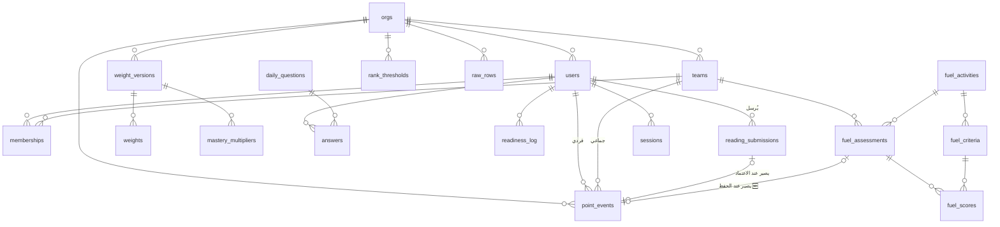

# قاعدة البيانات (Stage 3)

> **القاعدة:** لا جدول بلا غرض مكتوب، ولا فهرس بلا مسار استعلام يبرّره.

---

## ١. المبدأ الحاكم

> **الساعات فردية · الوقود جماعي · ولا يلتقيان.**

**تُحرَس بقيد `CHECK` في قاعدة البيانات، لا بكود التطبيق.**

**لماذا هنا تحديدًا؟** كود التطبيق يُنسى ويُلتفّ عليه بسكربت إداري يوم ضغط، أو
بمسار جديد يكتبه أحدهم بعد ستة أشهر ولم يقرأ هذا الملفّ. القيد لا يُنسى ولا
يُلتفّ عليه: **مخالفة القاعدة تصير مستحيلة فيزيائيًّا، لا ممنوعة أدبيًّا.**

هذا أهمّ سطر في التصميم كلّه.

---

## ٢. ERD



---

## ٣. الجداول — الغرض

**٢٤ جدولًا.** لكلٍّ سطرٌ يقول **لماذا يوجد**، والمعقّدة منها لها قسم مفصّل بعده.

| الجدول | لماذا يوجد |
|---|---|
| `orgs` | حاوية كل شيء، ومكان الإعدادات التي تختلف بين منظمة وأخرى (المنطقة الزمنية · بداية الأسبوع · مهلة «أرضي») |
| `users` | الطيارون والمشرفون — الهوية وبيانات الدخول. **بلا `role` وبلا `grounded`** |
| `teams` | الأسراب — وحدة التنافس الجماعي ومالكة عملة الوقود |
| `memberships` | **من في أي سرب ومتى** ودوره. فترة السريان تمنع أن ينقل طالبٌ تاريخَه لسربه الجديد |
| `point_events` | **سجلّ الأحداث — مصدر كل رصيد في المنصة.** لا عمود رصيد في أي مكان |
| `reading_submissions` | طلبات القراءة **قبل** اعتمادها — الحالة المعلَّقة التي لا مكان لها في سجلّ الحقائق |
| `weight_versions` | **إصدار أوزان بتاريخ سريان.** وجوده هو ما يجعل تعديل وزنٍ اليوم لا يمسّ أرقام الماضي |
| `weights` | قيمة النشاط الواحد بالساعات داخل إصدار. **صفوف لا كود** — فتقبل الصفحات والنسبة معًا |
| `mastery_multipliers` | مضاعف التقدير (متقن/مقبول/يحتاج إعادة) داخل إصدار. **مفصول عن `weights`** لأنه يضرب أنشطة عدّة لا نشاطًا واحدًا |
| `rank_thresholds` | عتبات الرتب. **صفوف** فإضافة رتبة شاشة إعدادات لا هجرة |
| `raw_rows` 🆕 | **الحمولة الخام كما وصلت، قبل أي اشتقاق.** بلاها تصحيحُ المعايرة بعد شهر يعني بيانات ضائعة (خ-٥) — و-٥ |
| `entry_defaults` 🆕 | القيم الافتراضية ومرادفات أعمدة الاستيراد — **تُبقي معرفة «الاسم البديل» بيانات لا شرطًا في الكود** — و-٥ |
| `daily_questions` | سؤال اليوم وخياراته وشرحه ومكافأته |
| `answers` | إجابة الطالب. **قيد فريد** يمنع الإجابة مرّتين — في القاعدة لا بإخفاء الزر |
| `notes` | **الصندوق الأسود:** قناة راجعة مجهولة. جهالتها **بنية الجدول** |
| `pilot_of_week` | اختيار الأسبوع **وسببه النصّي** — والقيمة كلها في «لماذا» |
| `fuel_activities` | الأنشطة الجماعية الأربعة وسعة لتراتها |
| `fuel_criteria` | بنود تقييم النشاط وأوزانها — **تجمع ١٠٠٪ بالضبط** |
| `fuel_assessments` | تقييم نشاطٍ لسربٍ في **تاريخ وقوعه** |
| `fuel_scores` | درجة كل بند **مفصّلة** — ليُشرح الرقم بعد شهر: «٨٠ × ٣٥٪ = ٢٨.٠٠» |
| `audit_log` | **التعويض عن دمج الدورين:** كل تغيير قاعدة مؤرَّخ ومنسوب ومرئيّ لكل المشرفين |
| `readiness_log` | تغييرات الجاهزية **اليدوية** من المشرف. (الحالة الآلية محسوبة ولا تُخزَّن) |
| `sessions` | **الجلسة كصفّ** — وهو ما يجعل إبطالها فوريًّا ممكنًا (ADR-003) |
| `login_attempts` | عدّ المحاولات للقفل بعد ٥. **في القاعدة لا في الذاكرة**: الذاكرة تضيع مع إعادة التشغيل وتكذب مع أكثر من عامل |

---

## ٣.١ الجداول المعقّدة — بالتفصيل

### `orgs` — المنظمة
**الغرض:** حاوية كل شيء، ومكان الإعدادات التي تختلف بين منظمة وأخرى.
**لماذا يوجد وعندنا منظمة واحدة؟** `org_id` يُحمَل **احتياطًا بلا عزل مستأجرين**
(القرار ٩). كلفته اليوم **عمود**؛ وإضافته لاحقًا **هجرة مؤلمة على كل جدول**.

```sql
orgs(
  id, name,
  timezone            DEFAULT 'Asia/Riyadh',
  week_starts_on      SMALLINT DEFAULT 6,
  grounded_after_days SMALLINT DEFAULT 14,
  tank_capacity_l     NUMERIC
)
```
- `week_starts_on` بترقيم `datetime.weekday`: ٠ الاثنين … **٦ الأحد**.
- `grounded_after_days` — **قاعدة «أرضي» إعدادٌ لا رقمٌ في الكود** (ف-٢).

---
### `users` — الطيارون والمشرفون
```sql
users(id, org_id, full_name, student_no, pin_hash, is_active,
      highest_achieved_tier SMALLINT NOT NULL DEFAULT 0)
  UNIQUE (org_id, student_no)
```
**لا عمود `role`:** الدور صفة على **العضوية** لا على المستخدم — فيمكن لشخص أن
يكون مشرفًا في منظمة ومستخدمًا في أخرى بلا تغيير في المخطط.

**لا عمود `grounded`:** ❌ **حُذف عمدًا.** الحالة **محسوبة** من آخر حدث معتمد
(FR-013)، وعمودٌ يحمل قيمة مشتقّة يفترق عن مصدره في أوّل مسار يَنسى تحديثه.

**`highest_achieved_tier` 🆕 — استثناءٌ من مبدأ «لا عمود مشتقّ»، ومسوَّغ عمدًا
(و-٧ · ت-٢).** الفرق عن `grounded`: `grounded` **يمكن اشتقاقه دائمًا** من
`point_events` وحده فلا خسارة في حذفه؛ أمّا هذا العمود فيحفظ **حقيقة لا يمكن
لأي استعلام لحظي استرجاعها بعد تغيّر العتبات** — أعلى رتبة بلغها الطالب
**تحت أيّ سُلّم عتبات سرى وقتًا ما**، لا تحت السُّلّم الحالي وحده. تغييرُ
عتبةٍ يُعيد تفسير الماضي كله فورًا (الرتبة **مشتقّة لحظيًّا** من الرصيد مقابل
السُّلّم الحالي)، وبلا هذا العمود تفقد الحقيقة القديمة إلى الأبد بمجرّد حفظ
عتبات جديدة. فهو **ليس مرآة رصيد** بل **مِسنَنٌ (ratchet) أحادي الاتّجاه** —
لا يُقرأ منه رصيد ولا يُشتقّ منه شيء غير الرتبة المعروضة.

**القيمة المعروضة دائمًا** `max(الرتبة المحسوبة من الرصيد الآن, هذا العمود)`
— التفصيل والمسوَّغ الكامل في `docs/slices/و-٧.md` §الرتب لا تنخفض.

**الافتراضي `0`:** لا رتبة في `rank_thresholds` تحمل `tier=0` (السُّلّم يبدأ من
`١`)، فـ`٠` قيمة حارسة لا رتبة حقيقية — لا تفوز أبدًا في `max()` قبل أن يبلغ
الطالب رتبته الأولى فعلًا.

---
### `teams` · `memberships` — الأسراب
```sql
teams(id, org_id, name, code, thread_color, archived_at)
  UNIQUE (org_id, code)

memberships(id, org_id, user_id, team_id, role, joined_at, left_at)
  UNIQUE (user_id) WHERE left_at IS NULL
```
`role ∈ ('pilot','admin')`.

**فترة السريان ليست ترفًا:** بلا `left_at` ينقل المشرفُ طالبًا عنده ٤٠٠ ساعة،
**فيقفز سربه الجديد في الترتيب بتاريخ لم يصنعه** (FR-083).

**أرشفة لا حذف:** `archived_at` — حذف السرب يتيّم أحداثه.

---
### `point_events` — سجلّ الأحداث ⭐ قلب النظام

**الرصيد = `SUM(delta)`. ولا عمود رصيد في أي مكان.**

**ما نكسبه:** تدقيق كامل (من منح؟ متى؟ لماذا؟) · تراجع بحدث معاكس بدل تعديل رقم
فيضيع التاريخ · «الأكثر تحسّنًا هذا الأسبوع» بفلترة تاريخ بلا حقل إضافي · صحّة
تحت التزامن بلا أقفال.

```sql
point_events(
  id, org_id,
  scope, user_id, team_id, currency,
  delta        NUMERIC(8,2),
  kind, reason, actor_id,
  external_ref,
  occurred_at, created_at
)

CHECK (scope='individual' AND user_id IS NOT NULL AND team_id IS NULL AND currency='hours'
    OR scope='team'       AND team_id IS NOT NULL AND user_id IS NULL AND currency='fuel')

CHECK (kind IN ('correction','manual') → reason IS NOT NULL) -- ث-٧ (وسّعت لتشمل الإدخال اليدوي، و-٦)
UNIQUE (org_id, external_ref) WHERE external_ref IS NOT NULL -- ث-٣ (فهرس جزئي)
TRIGGER point_events_no_mutation BEFORE UPDATE OR DELETE     -- ث-٢
```

| القرار | لماذا |
|---|---|
| `delta NUMERIC(8,2)` **لا `INTEGER`** | وزن المراجعة `0.25`، وخطأ `float` يتراكم عبر آلاف الصفوف حتى يظهر في الترتيب |
| `occurred_at` **≠** `created_at` | *متى وقع* غير *متى سُجّل*. الفرق هو ما يسمح بالتسجيل المتأخّر **وباختيار إصدار الأوزان الساري وقتها** |
| `reason` إلزامي على التصحيحات **والإدخال اليدوي** | كلاهما يبدو تلاعبًا بلا سبب مكتوب (و-٦) |
| `actor_id` | من فعل — أساس التدقيق |
| `external_ref` | idempotency: اللصق مرّتين لا يضاعف |

> **⚠️ تصحيح (و-٦، ٢٠٢٦-٠٩-٠٥):** كانت هذه الوثيقة تذكر عمود `raw_row_id`
> ("يربط الحدث بالصفّ الخام") **كأنه مبنيّ — وهو غير موجود** في
> `models/event.py` (تحقَّق بـ`grep`؛ الدرس ١٧ في `HANDOFF.md`). وقد **حُسم
> صراحةً** أن `FR-036` (الإدخال اليدوي) **لا يرتبط بـ`raw_row_id` ولا
> بـ`raw_rows`** — الإدخال اليدوي مختلف دلاليًّا عن الاستيراد الخام (`HANDOFF.md`
> §٩). **وحُسم نهائيًّا في و-٥ (٢٠٢٦-٠٩-٠٨):** لا يُبنى عمود ربط بين
> `point_events` والصفّ الخام **مطلقًا**، حتى بعد فكّ س-١ — الربط منطقيّ عبر
> `external_ref`/`batch_id` لا FK (`docs/slices/و-٥.md` §٢.١أ). لا وجود لهذا
> العمود اليوم ولا نيّة لبنائه لاحقًا.

> ### 🚫 **لا `UPDATE` ولا `DELETE` على هذا الجدول أبدًا.**
> التصحيح **حدث معاكس** بسبب مكتوب. وهذا ما يجعل **مرونة تعديل البيانات
> القرآنية الكاملة** (FR-035/036) متحقّقة **بلا** أن يفقد النظام تاريخه.

`kind` نصّ مفتوح: `'quran' · 'reading' · 'attendance' · 'daily_question' ·
'correction' · 'manual' · 'fuel'`.

---
### `reading_submissions` — الطلبات المعلَّقة 🆕

**الجدول الجديد الوحيد.**

**لماذا لا يُخزَّن في `point_events` بحالة `pending`؟**
لأن سجلّ الأحداث **سجلّ حقائق**: كل صفّ فيه أثّر في رصيد. صفٌّ يقول «ربما» يعني
أن كل استعلام رصيد في المشروع يجب أن يتذكّر استبعاده — و**أوّل استعلام ينساه
يعطي أرقامًا خاطئة بصمت**. الفصل يجعل النسيان مستحيلًا.

```sql
reading_submissions(
  id, org_id, user_id,
  read_on DATE, pages INT, book_title, activity_type,
  status, reviewer_id, review_reason, reviewed_at,
  point_event_id REFERENCES point_events(id),
  created_at
)
  CHECK (status IN ('pending','approved','rejected'))
  CHECK (pages > 0)
  CHECK (status='approved' AND point_event_id IS NOT NULL
      OR status<>'approved' AND point_event_id IS NULL)
  CHECK (status='rejected' → review_reason IS NOT NULL)
  CHECK (activity_type <> 'tahdir' OR EXTRACT(DOW FROM read_on) IN (0,1,2,3)) -- ث-١٨ (و-١١)
  UNIQUE (user_id, read_on, book_title, activity_type)
```

**`activity_type` 🆕 (و-١١):** نصّ مفتوح — نفس فلسفة `weights.activity_type`
(`ADR-005`): `'reading'` (القائم) و`'tahdir'` (تحضير القراءة) اليوم، وأيّ برنامج
قراءة مستقبليّ **صفٌّ لا هجرة**. **`kind` على `point_events` يبقى `'reading'`
للاثنين معًا** — لا يتغيّر — لأن `services/readiness.py` يحسب «أرضي» من
`kind IN ('quran','reading')`؛ لو حمل تحضير `kind` مختلفًا لخرج من هذا الحساب
بصمت. **نفس نمط `seed.py`:** إنجازات متعدّدة الأنواع (`activity_type` مختلف)
تحت `kind` واحد ثابت (`'quran'` هناك، `'reading'` هنا).

| القيد | الخطأ الذي يمنعه |
|---|---|
| `approved ⇔ point_event_id` | طلب معتمد بلا ساعات، أو ساعات بلا اعتماد |
| `rejected → review_reason` | رفض بلا سبب يراه الطالب |
| `UNIQUE(user, day, book, activity_type)` 🆕 | إرسال مزدوج بنقرتين — **موسَّع** ليسمح بقراءة وتحضير بنفس اليوم والعنوان معًا بلا تصادم |
| `tahdir → EXTRACT(DOW) IN (0..3)` 🆕 (ث-١٨) | تحضير بتاريخ خميس/جمعة/سبت — `EXTRACT(DOW)`: أحد=٠..سبت=٦ |

**الحدث يُنشأ بـ`occurred_at = read_on`** لا `reviewed_at` — تأخّر المشرف أسبوعًا
لا ينقل إنجاز الطالب إلى أسبوع آخر (FR-023).

**فهرس:** `(org_id, status, created_at) WHERE status='pending'` — طابور المشرف.

---
### الأوزان والرتب
```sql
weight_versions(id, org_id, effective_from, created_by, note)
weights(id, version_id, activity_type, hours_per_unit)
mastery_multipliers(id, version_id, grade, multiplier)
rank_thresholds(id, org_id, key, name, tier, at_hours)
```

**`activity_type` نصّ مفتوح — وهذا قرار لا كسل.** «حفظ» و«مراجعة» و«حضور»
و«قراءة» و**«نسبة إنجاز»** كلّها **صفوف لا كود**. فحين يصل تصدير راصد (س-١)
ويتبيّن أنه يعطي نسبة لا صفحات، التغيير **صفّان في جدول** لا هجرة (ف-٩).

**`rank_thresholds` صفوف كذلك:** السُّلّم أربع رتب اليوم وسيزيد — والإضافة
**شاشة إعدادات لا هجرة**.

**`effective_from` هو ما يمنع** أن يغيّر تعديلُ وزنٍ اليومَ أرقامَ الماضي.

---
### الاستيعاب 🆕 (و-٥)
```sql
raw_rows(
  id, org_id,
  batch_id VARCHAR,      -- SHA-256 مُقتضَب لمحتوى الدفعة (org+تاريخ+صفوف)
  source VARCHAR,        -- 'rasd' ثابتًا اليوم
  payload JSONB,         -- الصفّ الخام كاملًا كما وصل، بلا تنقية
  imported_by REFERENCES users(id),
  imported_at TIMESTAMPTZ
)
  INDEX (org_id, batch_id)  -- حارس تكرار الملفّ بالمجموع الاختباري (قرار #٩)

entry_defaults(
  id, org_id,
  activity_type VARCHAR,  -- 'quran_hifz_target' | 'quran_hifz_achieved' | ...
                           -- | 'attendance' | 'tasmi3_days' — صفٌّ لكل عمود
                           -- مصدر لا لكل فئة (`docs/slices/و-٥.md` §٢.٢)
  label VARCHAR,           -- الترويسة الكنسيّة الحالية
  quantity NUMERIC(8,2),   -- الافتراضي إن غابت الخليّة/العمود (عادة ٠)
  aliases JSONB            -- ترويسات بديلة مقبولة، بلا هجرة عند تغيّرها
)
  UNIQUE (org_id, activity_type)
```

**`raw_rows` هو ما يجعل إعادة الحساب ممكنة** (FR-086). بلا الخام، تصحيح المعايرة
بعد شهر يعني بيانات ضائعة — وهو الخطر الأعلى احتمالًا في `SCOPE.md` (خ-٥).

**بلا `raw_row_id` على `point_events`** — قرارٌ صريح من Recon و-٥
(`docs/slices/و-٥.md` §٢.١أ): الربط بين حدثٍ وصفّه الخام **منطقيّ لا FK**،
عبر `external_ref` (يحمل التاريخ والطالب والنشاط) و`batch_id` (يحمل عملية
الاستيراد كاملةً) — كافيان لإعادة الحساب المستقبلية بلا عمود إضافي على جدولٍ
مقفلٍ بلا `UPDATE`/`DELETE` أصلًا.

**صفّ واحد لكل صفّ طالب حقيقيّ فقط** — صفوف التذييل («الإجمالي»/«المتوسط»)
تُستبعَد **بالمحتوى** في `app/ingest/rasd.py` قبل الوصول إلى `raw_rows`، لا
بموضعها في الملفّ (كلا العيّنتين الحقيقيّتين تؤكّدان تطابق شكلهما مع صفّ
طالب حقيقيّ تمامًا).

---
### التفاعل
```sql
daily_questions(id, org_id, day, prompt, choices JSONB, correct_id, note, reward_hours)
answers(id, org_id, user_id, question_id, choice_id, correct, point_event_id)
  UNIQUE (user_id, question_id)
  CHECK ((NOT correct AND point_event_id IS NULL) OR (correct AND point_event_id IS NOT NULL))  -- ث-١٧

notes(id, org_id, body, day, read_at)
pilot_of_week(id, org_id, week_start, user_id, reason, actor_id)
  UNIQUE (org_id, week_start)
```

> ### 🔒 `notes` — **بلا `user_id` ولا `ip` ولا ربط بالجلسة**
> الجهالة **بنية الجدول لا بسياسة**. عمودٌ موجود «للطوارئ» يُستعمل يومًا،
> فينكشف طالب كتب شكوى — ومعه تموت القناة كلّها.
>
> و`day` **تاريخ لا طابع زمني**: الثانية تكشف المرسِل بمقارنتها بسجلّ الدخول.
> **الدقّة الزائدة هنا ثغرة خصوصية.**

---
### الوقود 🆕 (و-٨)
```sql
fuel_activities(id, org_id, key, name, litres_full, archived_at)
  UNIQUE (org_id, key)
  CHECK (litres_full > 0)

fuel_criteria(id, activity_id, key, name, weight_pct, position)
  UNIQUE (activity_id, key)
  CHECK (weight_pct > 0 AND weight_pct <= 100)

fuel_assessments(
  id, org_id, team_id, activity_id, occurred_on,
  total_pct, litres, note, actor_id,
  point_event_id REFERENCES point_events(id)
)
  UNIQUE (team_id, activity_id, occurred_on)
  CHECK (point_event_id IS NOT NULL)
  CHECK (total_pct >= 0)
  CHECK (litres >= 0)

fuel_scores(id, assessment_id, criterion_id, score_pct)
  UNIQUE (assessment_id, criterion_id)
  CHECK (score_pct >= 0 AND score_pct <= 100)
```

| القيد | الخطأ الذي يمنعه |
|---|---|
| `uq_fuel_activity_key` | نشاطان بمفتاح متطابق في منظمة واحدة |
| `fuel_criteria_weight_pct_range` | بندٌ وزنه صفر أو سالب أو يتجاوز ١٠٠٪ منفردًا |
| `uq_fuel_criterion_key` | بندان بمفتاح متطابق داخل نشاط واحد |
| `uq_fuel_assessment_per_day` | تقييم النشاط نفسه للسرب نفسه مرّتين في يوم واحد |
| **`fuel_assessments.point_event_id IS NOT NULL`** | **تقييمٌ بلا حدث محتسَب** — مطابق حرفيًّا لصرامة `reading_submissions`، لا `external_ref` وحده (قرار مؤرَّخ، انظر أدناه) |
| `uq_fuel_score_per_criterion` | بندٌ يُسجَّل له درجتان في تقييم واحد |
| `fuel_scores_score_pct_range` | درجة بند خارج ٠..١٠٠ |

**لماذا `point_event_id` صريح لا `external_ref` وحده؟** (قرار مؤرَّخ — و-٨)
`external_ref` يمنع **التكرار** (idempotency) فحسب؛ لا يثبت أن الصفّ **يملك**
حدثًا حقيقيًّا الآن. `reading_submissions` تحمل `point_event_id` صريحًا
بالضبط لهذا: قابليةٌ للفحص المباشر بالقاعدة («هل لهذا التقييم حدث؟») لا
اشتقاقًا من نمط نصّي. ولأن التقييم **لا حالة معلَّقة له** (خلافًا للقراءة التي
تمرّ بـ`pending`)، فلا حاجة لقيد `CHECK` مزدوج الاتّجاه كـث-٥ — **دومًا** غير
فارغ، فيُفرض بـ`NOT NULL` وحدها.

**ث-١٠ — أوزان الوقود تجمع ١٠٠٪: دفاعٌ مزدوج على نقطتين مختلفتين**، لا نقطة
واحدة ولا خدمة وحدها (قرار مؤرَّخ يُصحِّح `DATABASE.md` القديم في ضوء درس ث-٥):

| الثابت | يحرس | الفرض | يُمسك |
|---|---|---|---|
| **ث-١٠أ** | تعريف البنود: مجموع `weight_pct` لكل بنود نشاط واحد = ١٠٠٪ بالضبط | `TRIGGER AFTER` على `fuel_criteria` (نفس بنية ث-١٣أ — الادّعاء يمتدّ على كل بنود النشاط، لا يُعبَّر عنه بـ`CHECK` صفّي) + فحص تمهيدي في `services/fuel.py` | نشاطًا جديدًا أو تعديلًا يُخِلّ بالمجموع |
| **ث-١٠ب** | لحظة التقييم: مجموع `weight_pct` **للبنود التي شُملت فعلًا في هذا التقييم** (عبر `fuel_scores`) = ١٠٠٪ | `TRIGGER AFTER` على `fuel_scores` + فحص تمهيدي في `services/fuel.py` | **انجرافًا زمنيًّا**: نشاطٌ كان سليمًا عند التعريف ثم عُدِّل لاحقًا (أو عُدِّل عبر SQL خام يتجاوز ث-١٠أ) فصار مجموعه معطوبًا **قبل** أن يستعمله تقييم جديد بصمت؛ ويُمسك أيضًا تقييمًا يُغفل بندًا من بنود النشاط (تغطية جزئية) |

**لماذا نقطتان لا نقطة؟** ث-١٠أ يحرس **الإعداد** (نادر التكرار، يقع مرّة لكل
نشاط)، وث-١٠ب يحرس **الاستعمال** (يتكرّر مع كل تقييم) — ولكلٍّ فشلٌ لا يمنعه
الآخر: تعطيل ث-١٠أ (بخطأ مستقبلي أو مشغّل مُعطَّل يدويًّا) يترك نشاطًا معطوبًا
حيًّا حتى يُستعمَل، وث-١٠ب هو من يمسكه عند تلك اللحظة بالضبط.

**`fuel_scores` مفصّلة** ليُشرح الرقم بعد شهر: «٨٠ × ٣٥٪ = ٢٨.٠٠» (FR-071).
**`occurred_on` تاريخ الوقوع لا الإدخال** — التسجيل يتأخّر أيامًا وهذا متوقَّع
(م-٧)، ويُحوَّل إلى `occurred_at` UTC بنفس تحويل `RULES.md` §٩.

**لا تقاطع مع `rules/engine.py` ولا `weight_versions` ولا `rank_thresholds`:**
الوقود عملة جماعية منفصلة تمامًا (`scope='team'` · `currency='fuel'`) —
مؤكَّد بنصّ `ARCHITECTURE.md` («`rules/` لا تملك: ❌ الوقود»). `services/fuel.py`
يحسب `litres` بحساب نسبة مئوية بسيط، **لا** عبر `Achievement`/`ruleset_at`.

**الفهرس:** `fuel_assessments(org_id, team_id, occurred_on)` — محطة التزوّد
وسجلّ التقييمات الأخيرة.

---
### التشغيل
```sql
audit_log(id, org_id, kind, summary, before JSONB, after JSONB, actor_id, at)
readiness_log(id, org_id, user_id, grounded, reason, actor_id, at)
sessions(id, user_id, token_hash, expires_at, revoked)
login_attempts(id, org_id, student_no, ok, at)
```
**`audit_log` هو التعويض عن دمج الدورين** (`SCOPE.md` §٣.٣). قيمته **مشروطة
بكونه مرئيًّا فعلًا** لكل المشرفين (FR-084) — سجلٌّ مدفون لا يحمي من شيء.

---

## ٤. الفهارس والقيود الفريدة

**كلّها هنا — لا شيء مبعثر في الأقسام.** ولكلٍّ **مسار استعمال مسمّى**.

### ٤.١ فهارس الأداء
| الفهرس | المسار |
|---|---|
| `point_events(org_id, user_id, occurred_at) WHERE scope='individual'` | رصيد الطالب · سجلّه · الصدارة الفردية |
| `point_events(org_id, team_id, occurred_at) WHERE scope='team'` | وقود السرب · محطة التزوّد |
| `reading_submissions(org_id, created_at) WHERE status='pending'` | **طابور اعتماد المشرف** — الأقدم أوّلًا |
| `memberships(team_id) WHERE left_at IS NULL` | أعضاء السرب الحاليون · معدّل السرب |
| `notes(org_id, day)` | قائمة الملاحظات مرتّبة |
| `sessions(token_hash)` | **التحقّق على كل طلب** — أكثر استعلام تنفيذًا في المنصة |
| `login_attempts(org_id, student_no, at)` | عدّ محاولات آخر ١٥ دقيقة |
| `audit_log(org_id, at)` | صفحة سجلّ التغييرات |

### ٤.٢ قيود فريدة — كلٌّ يمنع خطأً بعينه
| القيد | الخطأ الذي يمنعه |
|---|---|
| `users(org_id, student_no)` | رقما طالب متطابقان ⇒ دخول ملتبس |
| `point_events(org_id, external_ref) WHERE external_ref IS NOT NULL` | **الـidempotency:** إعادة اللصق تضاعف الرصيد |
| `memberships(user_id) WHERE left_at IS NULL` | طالب في سربين ⇒ يُحتسب مرّتين في معدّلين |
| `reading_submissions(user_id, read_on, book_title)` | إرسال مزدوج بنقرتين |
| `answers(user_id, question_id)` | الإجابة مرّتين ⇒ مكافأة مضاعفة |
| `pilot_of_week(org_id, week_start)` | طياران لأسبوع واحد |
| `fuel_assessments(team_id, activity_id, occurred_on)` | تقييم النشاط نفسه مرّتين للسرب نفسه |
| `teams(org_id, code)` | رمزا سرب متطابقان في اللصق |

**٨ فهارس + ٨ قيود.** ولا شيء غيرها: كل فهرس زائد **كلفةُ كتابة على كل إدخال**،
وشاشة اللصق تكتب عشرات الصفوف دفعة واحدة تحت معيار «أقلّ من دقيقة» (NFR-02).

---

## ٤.٣ الثوابت ← مواضع الفرض

> **القاعدة الحاكمة (ADR-002):** الثابت الذي يُفرض في كود التطبيق وحده **يُنسى
> ويُلتفّ عليه**. ما يمكن فرضه في القاعدة **يُفرض فيها**.

| # | الثابت | موضع الفرض | الاختبار الذي يثبته |
|---|---|---|---|
| ث-١ | الساعات فردية · الوقود جماعي · ولا يلتقيان | **`CHECK currency_scope_match`** | إدخال الصور الأربع المخالفة ⇒ رفض |
| ث-٢ | **لا `UPDATE` ولا `DELETE` على `point_events`** | **`TRIGGER BEFORE UPDATE OR DELETE`** يرفع خطأً | `UPDATE` و`DELETE` مباشران ⇒ استثناء |
| ث-٣ | إعادة الاستيراد لا تضاعف | فهرس فريد على `external_ref` | **لصق الملفّ مرّتين ⇒ الرصيد لم يتغيّر** (م-١) |
| ث-٤ | عضوية واحدة سارية لكل طالب | فهرس فريد جزئي | عضوية ثانية بلا `left_at` ⇒ رفض |
| ث-٥ | طلب معتمد ⇔ له حدث | `CHECK (approved ⇔ point_event_id IS NOT NULL)` | اعتماد بلا حدث ⇒ رفض |
| ث-٦ | الرفض يوجب سببًا | `CHECK (rejected → review_reason IS NOT NULL)` | رفض بلا سبب ⇒ رفض |
| ث-٧ | التصحيح **أو الإدخال اليدوي** يوجب سببًا | `CHECK (kind IN ('correction','manual') → reason IS NOT NULL)` | حدث معاكس أو إدخال يدويّ بلا سبب ⇒ رفض |
| ث-٨ | إجابة واحدة لكل سؤال | فهرس فريد | إجابة ثانية ⇒ `409` |
| ث-٩ | طيار أسبوع واحد | فهرس فريد | اختيار ثانٍ ⇒ رفض |
| ث-١٠ | أوزان الوقود تجمع ١٠٠٪ | **`services/fuel.py`** — لأن الجمع عبر صفوف لا يُعبَّر عنه بـ`CHECK` صفّي | مجموع ٩٥ ⇒ `422` |
| ث-١١ | الأوزان تُختار بـ`occurred_at` لا `now()` | **`rules/engine.py::ruleset_at`** | حدث ماضٍ بعد إصدار جديد ⇒ يستعمل الوزن القديم |
| ث-١٢ | `notes` بلا أثر يربطها بمرسِلها | **بنية الجدول** — لا عمود أصلًا | فحص المخطط: لا `user_id` ولا `ip` |
| ث-١٣أ | **سُلّم العتبات متّسق:** `tier` أعلى ⇔ `at_hours` أعلى | **`TRIGGER` على `rank_thresholds`** — فحصٌ يمتدّ على كل صفوف المنظمة، فلا يُعبَّر عنه بـ`CHECK` صفّي | إدخال ترتيب متناقض ⇒ استثناء من القاعدة |
| ث-١٣ب | **الرتبة المعروضة لا تنخفض** بتغيير العتبات | `services/rules_admin.py` يكتب `users.highest_achieved_tier` (يزيد فقط) + **`TRIGGER` يرفض أي تحديث ينقصه** — دفاعٌ مزدوج: الخدمة تقرّر متى يرتفع، والقاعدة تمنع أن ينخفض ولو بخطأ مستقبلي في الخدمة | تحديثٌ مباشر بقيمة أقلّ ⇒ استثناء · معاينة تُظهر `demoted` فارغًا دائمًا |
| ث-١٤ | «أرضي» محسوبة لا مخزَّنة | **بنية الجدول** — لا عمود `grounded` | فحص المخطط: لا عمود في `users` |
| ث-١٥ | كل إلحاق يمرّ بـ`ledger` | **مراجعة + `grep`** — لا يُفرض تقنيًّا | `grep -rn "PointEvent(" app/ --exclude=ledger.py` ⇒ فارغ |
| ث-١٦ | سؤال يومٌ واحد لكل منظمة | `UNIQUE(org_id, day)` على `daily_questions` (و-٩ج) | سؤالان لنفس اليوم ⇒ استثناء من القاعدة |
| ث-١٧ | `answers.correct` و`point_event_id` لا يفترقان — دفاعٌ مزدوج (نمط ث-١٣ب) | `CHECK` على `answers` + `services/engagement.py::answer` (يكتب الاثنين بـ`commit` واحد عبر `ledger.append_pending`) (و-٩د) | إجابة صحيحة بلا حدث، أو خاطئة بحدث — استثناء من القاعدة في الحالتين |
| ث-١٨ | تحضير القراءة **الأحد–الأربعاء حصرًا** — دفاعٌ مزدوج | `CHECK (activity_type<>'tahdir' OR EXTRACT(DOW FROM read_on) IN (0,1,2,3))` + `services/reading.py` (فحص قبل الإدراج، رسالة عربية واضحة) (و-١١) | تحضير بتاريخ خميس/جمعة/سبت ⇒ رفض من الخدمة **و**من القاعدة لو التُفَّ عليها |

### ث-٢ — الثابت الذي كاد يسقط

«لا `UPDATE` ولا `DELETE`» كانت **قاعدة مكتوبة في `AGENTS.md` بلا فرض تقني** —
وهو **نقضٌ حرفيّ لـADR-002**: طبّقنا مبدأ «القيد لا يُنسى» على العملات ونسيناه
على السجلّ نفسه.

```sql
CREATE FUNCTION point_events_append_only() RETURNS trigger AS $$
BEGIN
  RAISE EXCEPTION 'point_events سجلّ إلحاق فقط: التصحيح حدث معاكس بسبب مكتوب';
END $$ LANGUAGE plpgsql;

CREATE TRIGGER point_events_no_mutation
  BEFORE UPDATE OR DELETE ON point_events
  FOR EACH ROW EXECUTE FUNCTION point_events_append_only();
```

**و`TRUNCATE` لا يُطلق مشغّلات الصفوف** — فـ`seed.py` والاختبارات تعمل بلا تغيير.
هذا ليس التفافًا على الحماية: `TRUNCATE` يحتاج قفلًا حصريًّا وصلاحية، ولا يقع
عرَضًا في مسار تطبيقي.

### ث-١٥ — الثابت الوحيد بلا فرض تقني

ملكية `ledger` **لا يمكن فرضها بقيد** — لا شيء في PostgreSQL يعرف أي وحدة بايثون
أصدرت `INSERT`. فرضها **مراجعة + `grep` قابل للتنفيذ**، وهذا **حدّ معلَن لا
ادّعاء**: ث-٢ يحرس أخطر ما في السجلّ (التعديل) بالقاعدة، وث-١٥ يحرس الاتّساق
بالمراجعة.

---

## ٥. الهجرات

**Alembic هو المصدر الوحيد للمخطط.** لا `create_all` — يجعل التطوير والإنتاج
يفترقان بصمت، فيظهر الفرق أوّل مرة في الإنتاج.

**`seed.py` يستعمل `TRUNCATE ... RESTART IDENTITY`** فتصير المعرّفات حتمية،
والاختبارات مستقرّة، والأخطاء قابلة لإعادة الإنتاج.
