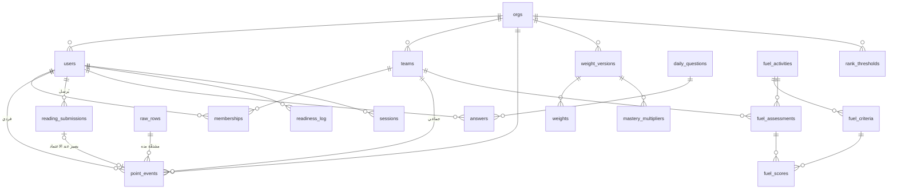

# قاعدة البيانات (Stage 3)

> **القاعدة:** لا جدول بلا غرض مكتوب، ولا فهرس بلا مسار استعلام يبرّره.

---

## ١. المبدأ الحاكم

> **الساعات فردية · الوقود جماعي · ولا يلتقيان.**

**تُحرَس بقيد `CHECK` في قاعدة البيانات، لا بكود التطبيق.**

**لماذا هنا تحديدًا؟** كود التطبيق يُنسى ويُلتفّ عليه بسكربت إداري يوم ضغط، أو
بمسار جديد يكتبه أحدهم بعد ستة أشهر ولم يقرأ هذا الملفّ. القيد لا يُنسى ولا
يُلتفّ عليه: **مخالفة القاعدة تصير مستحيلة فيزيائيًّا، لا ممنوعة أدبيًّا.**

هذا أهمّ سطر في التصميم كلّه.

---

## ٢. ERD



---

## ٣. الجداول

### `orgs` — المنظمة
**الغرض:** حاوية كل شيء، ومكان الإعدادات التي تختلف بين منظمة وأخرى.
**لماذا يوجد وعندنا منظمة واحدة؟** `org_id` يُحمَل **احتياطًا بلا عزل مستأجرين**
(القرار ٩). كلفته اليوم **عمود**؛ وإضافته لاحقًا **هجرة مؤلمة على كل جدول**.

```sql
orgs(
  id, name,
  timezone            DEFAULT 'Asia/Riyadh',
  week_starts_on      SMALLINT DEFAULT 6,
  grounded_after_days SMALLINT DEFAULT 14,
  tank_capacity_l     NUMERIC
)
```
- `week_starts_on` بترقيم `datetime.weekday`: ٠ الاثنين … **٦ الأحد**.
- `grounded_after_days` — **قاعدة «أرضي» إعدادٌ لا رقمٌ في الكود** (ف-٢).

---
### `users` — الطيارون والمشرفون
```sql
users(id, org_id, full_name, student_no, pin_hash, is_active)
  UNIQUE (org_id, student_no)
```
**لا عمود `role`:** الدور صفة على **العضوية** لا على المستخدم — فيمكن لشخص أن
يكون مشرفًا في منظمة ومستخدمًا في أخرى بلا تغيير في المخطط.

**لا عمود `grounded`:** ❌ **حُذف عمدًا.** الحالة **محسوبة** من آخر حدث معتمد
(FR-013)، وعمودٌ يحمل قيمة مشتقّة يفترق عن مصدره في أوّل مسار يَنسى تحديثه.

---
### `teams` · `memberships` — الأسراب
```sql
teams(id, org_id, name, code, thread_color, archived_at)

memberships(id, org_id, user_id, team_id, role, joined_at, left_at)
  UNIQUE (user_id) WHERE left_at IS NULL
```
`role ∈ ('pilot','admin')`.

**فترة السريان ليست ترفًا:** بلا `left_at` ينقل المشرفُ طالبًا عنده ٤٠٠ ساعة،
**فيقفز سربه الجديد في الترتيب بتاريخ لم يصنعه** (FR-083).

**أرشفة لا حذف:** `archived_at` — حذف السرب يتيّم أحداثه.

---
### `point_events` — سجلّ الأحداث ⭐ قلب النظام

**الرصيد = `SUM(delta)`. ولا عمود رصيد في أي مكان.**

**ما نكسبه:** تدقيق كامل (من منح؟ متى؟ لماذا؟) · تراجع بحدث معاكس بدل تعديل رقم
فيضيع التاريخ · «الأكثر تحسّنًا هذا الأسبوع» بفلترة تاريخ بلا حقل إضافي · صحّة
تحت التزامن بلا أقفال.

```sql
point_events(
  id, org_id,
  scope, user_id, team_id, currency,
  delta        NUMERIC(8,2),
  kind, reason, actor_id,
  external_ref, raw_row_id,
  occurred_at, created_at
)

CHECK (scope='individual' AND user_id IS NOT NULL AND team_id IS NULL AND currency='hours'
    OR scope='team'       AND team_id IS NOT NULL AND user_id IS NULL AND currency='fuel')
```

| القرار | لماذا |
|---|---|
| `delta NUMERIC(8,2)` **لا `INTEGER`** | وزن المراجعة `0.25`، وخطأ `float` يتراكم عبر آلاف الصفوف حتى يظهر في الترتيب |
| `occurred_at` **≠** `created_at` | *متى وقع* غير *متى سُجّل*. الفرق هو ما يسمح بالتسجيل المتأخّر **وباختيار إصدار الأوزان الساري وقتها** |
| `reason` إلزامي على التصحيحات | التصحيح بلا سبب يبدو تلاعبًا |
| `actor_id` | من فعل — أساس التدقيق |
| `external_ref` | idempotency: اللصق مرّتين لا يضاعف |
| `raw_row_id` | يربط الحدث بالصفّ الخام — أساس إعادة الحساب |

> ### 🚫 **لا `UPDATE` ولا `DELETE` على هذا الجدول أبدًا.**
> التصحيح **حدث معاكس** بسبب مكتوب. وهذا ما يجعل **مرونة تعديل البيانات
> القرآنية الكاملة** (FR-035/036) متحقّقة **بلا** أن يفقد النظام تاريخه.

`kind` نصّ مفتوح: `'quran' · 'reading' · 'attendance' · 'daily_question' ·
'correction' · 'manual' · 'fuel'`.

---
### `reading_submissions` — الطلبات المعلَّقة 🆕

**الجدول الجديد الوحيد.**

**لماذا لا يُخزَّن في `point_events` بحالة `pending`؟**
لأن سجلّ الأحداث **سجلّ حقائق**: كل صفّ فيه أثّر في رصيد. صفٌّ يقول «ربما» يعني
أن كل استعلام رصيد في المشروع يجب أن يتذكّر استبعاده — و**أوّل استعلام ينساه
يعطي أرقامًا خاطئة بصمت**. الفصل يجعل النسيان مستحيلًا.

```sql
reading_submissions(
  id, org_id, user_id,
  read_on DATE, pages INT, book_title,
  status, reviewer_id, review_reason, reviewed_at,
  point_event_id REFERENCES point_events(id),
  created_at
)
  CHECK (status IN ('pending','approved','rejected'))
  CHECK (pages > 0)
  CHECK (status='approved' AND point_event_id IS NOT NULL
      OR status<>'approved' AND point_event_id IS NULL)
  CHECK (status='rejected' → review_reason IS NOT NULL)
  UNIQUE (user_id, read_on, book_title)
```

| القيد | الخطأ الذي يمنعه |
|---|---|
| `approved ⇔ point_event_id` | طلب معتمد بلا ساعات، أو ساعات بلا اعتماد |
| `rejected → review_reason` | رفض بلا سبب يراه الطالب |
| `UNIQUE(user, day, book)` | إرسال مزدوج بنقرتين |

**الحدث يُنشأ بـ`occurred_at = read_on`** لا `reviewed_at` — تأخّر المشرف أسبوعًا
لا ينقل إنجاز الطالب إلى أسبوع آخر (FR-023).

**فهرس:** `(org_id, status, created_at) WHERE status='pending'` — طابور المشرف.

---
### الأوزان والرتب
```sql
weight_versions(id, org_id, effective_from, created_by, note)
weights(id, version_id, activity_type, hours_per_unit)
mastery_multipliers(id, version_id, grade, multiplier)
rank_thresholds(id, org_id, key, name, tier, at_hours)
```

**`activity_type` نصّ مفتوح — وهذا قرار لا كسل.** «حفظ» و«مراجعة» و«حضور»
و«قراءة» و**«نسبة إنجاز»** كلّها **صفوف لا كود**. فحين يصل تصدير راصد (س-١)
ويتبيّن أنه يعطي نسبة لا صفحات، التغيير **صفّان في جدول** لا هجرة (ف-٩).

**`rank_thresholds` صفوف كذلك:** السُّلّم أربع رتب اليوم وسيزيد — والإضافة
**شاشة إعدادات لا هجرة**.

**`effective_from` هو ما يمنع** أن يغيّر تعديلُ وزنٍ اليومَ أرقامَ الماضي.

---
### الاستيعاب
```sql
raw_rows(id, org_id, batch_id, source, payload JSONB, imported_by, imported_at)
entry_defaults(id, org_id, activity_type, quantity, label, aliases JSONB)
```
**`raw_rows` هو ما يجعل إعادة الحساب ممكنة** (FR-086). بلا الخام، تصحيح المعايرة
بعد شهر يعني بيانات ضائعة — وهو الخطر الأعلى احتمالًا في `SCOPE.md` (خ-٥).

---
### التفاعل
```sql
daily_questions(id, org_id, day, prompt, choices JSONB, correct_id, note, reward_hours)
answers(id, org_id, user_id, question_id, choice_id, correct)
  UNIQUE (user_id, question_id)

notes(id, org_id, body, day, read_at)
pilot_of_week(id, org_id, week_start, user_id, reason, actor_id)
  UNIQUE (org_id, week_start)
```

> ### 🔒 `notes` — **بلا `user_id` ولا `ip` ولا ربط بالجلسة**
> الجهالة **بنية الجدول لا بسياسة**. عمودٌ موجود «للطوارئ» يُستعمل يومًا،
> فينكشف طالب كتب شكوى — ومعه تموت القناة كلّها.
>
> و`day` **تاريخ لا طابع زمني**: الثانية تكشف المرسِل بمقارنتها بسجلّ الدخول.
> **الدقّة الزائدة هنا ثغرة خصوصية.**

---
### الوقود
```sql
fuel_activities(id, org_id, key, name, litres_full, archived_at)
fuel_criteria(id, activity_id, key, name, weight_pct, position)
fuel_assessments(id, org_id, team_id, activity_id, occurred_on, total_pct, litres, note, actor_id)
  UNIQUE (team_id, activity_id, occurred_on)
fuel_scores(id, assessment_id, criterion_id, score_pct)
```
**الأوزان تجمع ١٠٠٪ بالضبط** — يُفرَض عند التقييم لا في المخطط: نشاط أوزانه ٩٥
يجعل الإتقان الكامل ٩٥٪، **فيظنّ السرب أنه قصّر وهو أتقن**.

**`fuel_scores` مفصّلة** ليُشرح الرقم بعد شهر: «٨٠ × ٣٥٪ = ٢٨.٠٠».
**`occurred_on` تاريخ الوقوع لا الإدخال** — التسجيل يتأخّر أيامًا وهذا متوقَّع.

---
### التشغيل
```sql
audit_log(id, org_id, kind, summary, before JSONB, after JSONB, actor_id, at)
readiness_log(id, org_id, user_id, grounded, reason, actor_id, at)
sessions(id, user_id, token_hash, expires_at, revoked)
login_attempts(id, org_id, student_no, ok, at)
```
**`audit_log` هو التعويض عن دمج الدورين** (`SCOPE.md` §٣.٣). قيمته **مشروطة
بكونه مرئيًّا فعلًا** لكل المشرفين (FR-084) — سجلٌّ مدفون لا يحمي من شيء.

---

## ٤. الفهارس

| الفهرس | المسار الذي يخدمه |
|---|---|
| `point_events(org_id, user_id, occurred_at) WHERE scope='individual'` | رصيد الطالب وسجلّه · الصدارة الفردية |
| `point_events(org_id, team_id, occurred_at) WHERE scope='team'` | وقود السرب · محطة التزوّد |
| `UNIQUE point_events(org_id, external_ref) WHERE external_ref IS NOT NULL` | **الـidempotency** |
| `reading_submissions(org_id, status, created_at) WHERE status='pending'` | طابور الاعتماد |
| `memberships(team_id) WHERE left_at IS NULL` | أعضاء السرب الحاليون |
| `notes(org_id, day)` | قائمة الملاحظات |
| `sessions(token_hash)` | التحقّق على **كل طلب** |

**سبعة فهارس، ولكلٍّ مسار مسمّى.** كل فهرس زائد كلفةُ كتابة على **كل** إدخال —
وشاشة اللصق تكتب عشرات الصفوف دفعة واحدة تحت معيار «أقلّ من دقيقة».

---

## ٥. الهجرات

**Alembic هو المصدر الوحيد للمخطط.** لا `create_all` — يجعل التطوير والإنتاج
يفترقان بصمت، فيظهر الفرق أوّل مرة في الإنتاج.

**`seed.py` يستعمل `TRUNCATE ... RESTART IDENTITY`** فتصير المعرّفات حتمية،
والاختبارات مستقرّة، والأخطاء قابلة لإعادة الإنتاج.
